# Copilot Chat

## 시작 전 안내
- **교안**: 바탕화면에 있는 ‘교안 및 실습 자료’ 폴더 안에서 교안을 열 수 있도록
- **실습 파일 위치**: 각 교육 날짜와 시간에 맞는 폴더 / EX ) 7월 7일 오전, 7월 7일 오후

## 기본 설명
### m365.cloud.microsoft
**m365.cloud.microsoft**(Copilot Chat)는 Agent를 호출할 수 있는 **AI 작업 공간** (Microsoft 365 Copilot 앱)
- 사용자가 직접 프롬프트를 입력해 대화형으로 질문하고 답변을 받을 수 있는 **Chat 기능**과, 
- 특정 업무에 최적화된 Agent를 호출해 복잡한 업무를 수행할 수 있는 **Agent 기능 **제공에
- +M365앱(Page,Notebook 등)과 연동 +Agent Store 등 제공

### Chat vs Agent

|항목|Chat|Agent|
|---|---|---|
|설계|웹 기반 AI|특정 업무에 최적화된 전문 Agent|
|비유|비서|각 담당자(디지털 팀원), 데이터 분석가, 연구원, 프로젝트 매니저 등|
|상태|대화 중심|작업 중심|
|주체|사용자가 직접 프로세스/단계 지시|Agent가 스스로 프로세스/단계 수행|
|동작방식|Prompt>LLM>Response|Prompt>Goals>Reasoning>Plan>Actions>Execute>Result|
|예시|엑셀 데이터 분석해줘>차트,인사이트, 설명|손해율과 판매량 관계 분석>코드생성, 모델링,시나리오 분석,결과보고

예를 들어,
|Agent|사용자|설명|
|---|---|---|
|M365 App Agent|Excel/Word/PPT..|업무용 M365 앱에 특화된 Agent|
|Frontier Agent|Researcher/Analyst..|연구, 분석, 아이디어 구체화에 특화된 Agent|
|Custom Agent|Agent Builder/Copilot Studio|사용자가 직접 설계한 맞춤형 Agent|
|Teams Agent|Collab/Planner/Business App..|Teams 협업, 일정, 업무 앱에 특화된 Agent|


### 1. 메인 화면 설명

**모델**
- **Deep Reasoning:** 단순한 즉답형 답변과 달리, 복잡한 질문에 대해 답변하기 전 내부적으로 계획을 세우고 논리적인 추론 과정을 거칩니다. 사용자는 이 과정에서 AI가 어떻게 문제를 해결하려 하는지 **투명한 추론 경로(Transparency Trail)** 를 확인할 수 있습니다.
- **복합적 문제 해결:** 단순한 지식 검색이 아니라 연구, 분석, 아이디어 구체화가 필요한 복잡한 작업에 적합합니다. 마치 '인턴'에게 일을 시키듯, 충분히 생각할 시간을 주어 더 효율적이고 체계적인 결과를 도출하도록 유도합니다.
- **상황에 따른 선택:**
  - **빠른 응답:** 질문자가 이미 정답을 알고 있거나 단순 확인이 필요한 경우.
  - **Think Deeper:** 연구가 필요하거나, 여러 변수를 고려해야 하는 복잡한 문제, 효율적인 계획 수립이 필요할 때 선택합니다.

**메모리:**
- **개인화된 대화:** 사용자의 역할, 관심사, 작업 중인 프로젝트, 선호하는 말하기 방식 등을 기억하여 향후 답변에 반영합니다 
- **맞춤 설정:** 설정 메뉴를 통해 Copilot이 항상 어떤 방식으로 응답해야 하는지 직접 지시할 수 있습니다. 이 설정은 사용자가 토글을 끄지 않는 한 계속 유지됩니다 
- **저장된 메모리:** 대화 도중 사용자가 특정 정보를 입력하면 Copilot이 이를 저장하고, 이후 관련 주제를 대화할 때 해당 정보를 자동으로 적용합니다
- **대화 맥락 이해:** 과거 대화 기록을 기반으로 현재 작업과 관련된 맥락을 파악합니다. 예를 들어, "지난 5번의 대화를 요약해달라"는 식으로 이전 내용을 상기시키는 요청이 가능

**데이터 시각화**
- **시각화 요청:** Copilot은 내부적으로 Python 코드를 생성하여 데이터를 분석하고 그래프를 그려줍니다.
- **상호작용:** 그래프 위에 마우스를 올리면 정확한 수치 데이터를 확인할 수 있습니다.
- **공유:** 생성된 데이터 분석 결과와 그래프는 **Copilot 페이지**로 전송하여 팀원들과 공동으로 검토하고 수정할 수 있습니다.

**에이전트 호출, /, 파일 추가**
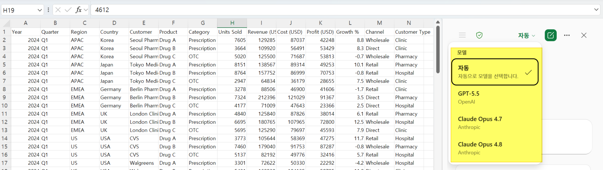

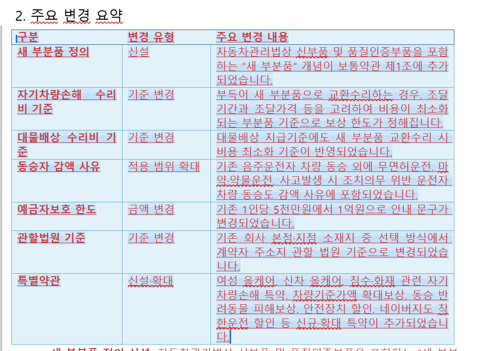
**앱**


### 2. 페이지
AI 출력을 동료와 공유하고 공동 작업하는 협업 공간/ 저장한 출력 기록 조회/확인
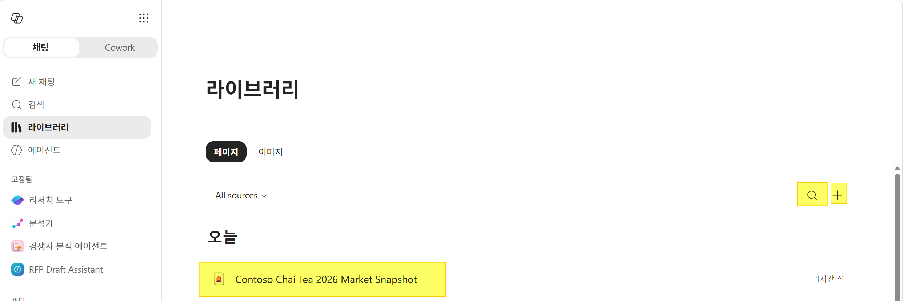

### 3. 에이전트 리스트
핀 고정
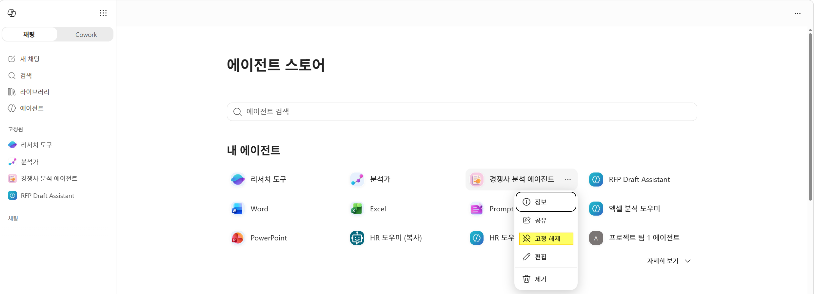


## 분석가
- AI 기반 데이터 분석 도우미로, 복잡한 데이터를 빠르게 이해하고 인사이트를 제공하는 역할
- OpenAI의 o3-mini reasoning 모델을 활용해 사람처럼 단계적으로 사고하며 문제를 해결합니다.
- 단순한 질문만 입력해도 데이터를 분석해 차트, 테이블, 보고서 형태로 결과를 보여줍니다.
- Python 실행 가능: 복잡한 데이터 쿼리를 위해 Python 코드를 직접 실행하며, 사용자가 코드와 결과를 확인할 수 있습니다.

> 엑셀 실습 파일 업로드 후 시스템 프롬프트에서 제공하는 프롬프트 선택
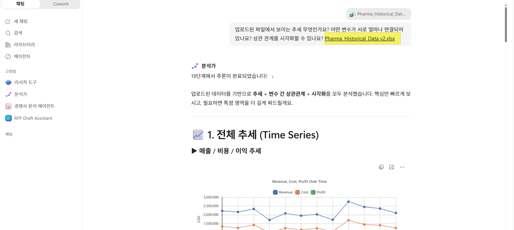

## 브랜드 키트
> 앱 목록 및 브랜드 키트 데모
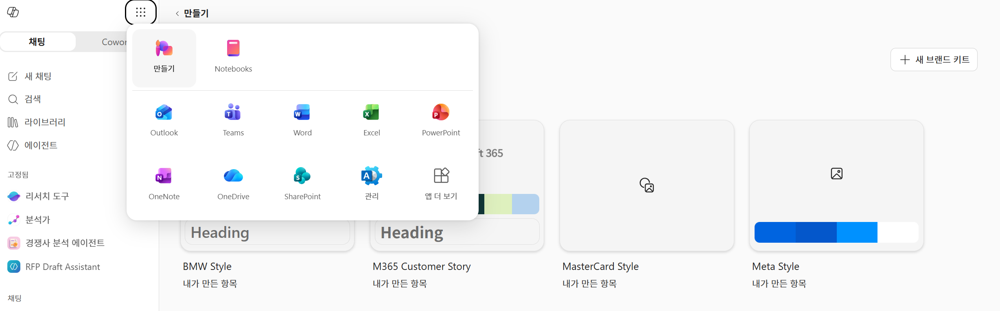
> - 결과: BMW Style: **BeOneMedicines 회사소개서**
> - 결과: Customer Story: **brand-template-customer story**

## Hands-on Chat
### Prompt 1
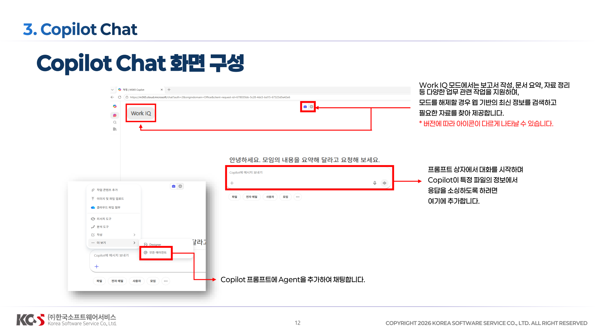
 https://www.kcaca.or.kr/inform/data.html 

```
https://www.kcaca.or.kr/inform/data.html 
이 링크의 최신 게시글 중 'AI 시대 진화하는 보험사기, 범정부 공조' 보도자료 내용을 요약해줘.
삼성화재의 심사 및 보상 과정에서 이러한 고도화된 사기를 조기에 탐지하고 대응하기 위한 업무 프로세스 가이드를 작성해줘.
```

### Prompt 2
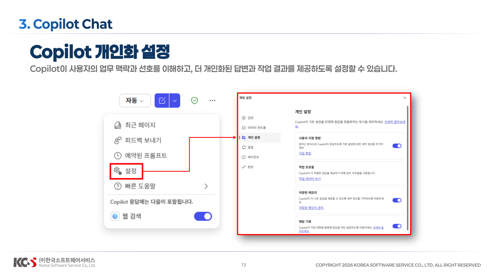
```
클레임(사고/보상) 유형별 발생 비중을 요약하고, 급증 구간이 있으면 원인 가설을 3가지 제안해 줘. 
```
```
인사이트를 요약해 세일즈/업무 개선 보고서 초안을 작성해 줘.
```

### Prompt 3
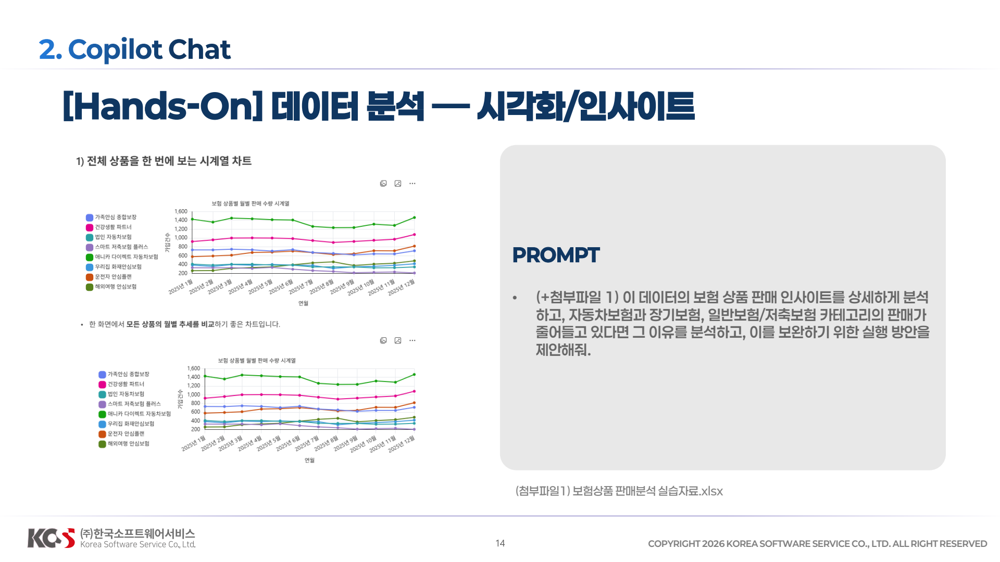
**(첨부파일1) 보험상품_판매분석_실습자료.xlsx**
```
이 데이터의 보험 상품 판매 인사이트를 상세하게 분석하고, 자동차보험과장기보험, 일반보험/저축보험 카테고리의 판매가 줄어들고 있다면 그 이유를 분석하고, 이를 보완하기 위한 실행 방안을 제안해줘
```
> 1.시나리오: Chat > OneDrive에서 파일 선택 > 결과 > Pages에 추가 / 다음으로 내보내기(Word)
> 

> 엑셀 실습 파일 업로드 후 시스템 프롬프트에서 제공하는 프롬프트 선택


## Tips & Tricks
### Excel Agent
Chat 에서 **Excel Agent**에서도 동일 프롬프트 보여주기
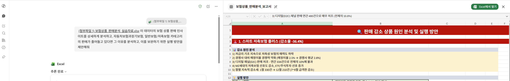

## 리서치 도구
### 모델 설명
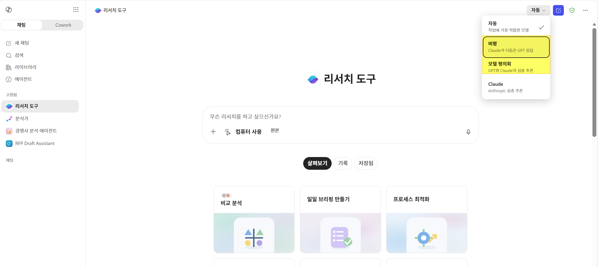

### 기본
웹 금지 상태
```
삼성화재 자동차 보험 상품 중 '다이렉트 기본형'과 '프리미엄형'의 보장 차이를 내부 상품 설명서를 기반으로 표로 정리해줘.
```

### 비평 
**내부 데이터 리포트 비평**
- Copilot의 리서치 비평 모델을 활용하면, 단순히 자료를 요약하는 것에 그치지 않고 자료의 신뢰성, 편향 여부, 해석상의 한계까지 짚어주는 역할
- 즉, "데이터를 어떻게 읽어야 하는지"를 알려주는 비평적 시각을 제공
- Copilot이 단순히 "무슨 내용이다"를 말하는 게 아니라, 자료를 비판적으로 읽고 해석하는 데 도움을 주는 리서치 파트너로 작동
```
지난 분기 손해율 및 청구 데이터 리포트를 검토해 주세요. 
데이터에서 드러나는 주요 트렌드를 요약하고, 분석 방법론의 한계나 놓친 변수들을 비평하세요. 
경영진이 의사결정에 참고할 수 있도록 '강점 / 약점 / 추가 검토 필요 영역'으로 구분해 주세요.
```


### Council: 
-  여러 AI 모델(GPT와 Claude)을 동시에 활용해 동일한 질문에 대해 각각 독립적인 보고서를 생성하고, 그 결과를 비교·통합할 수 있도록 해주는 다중 모델 비교 모드
- 즉, 단일 모델의 관점이 아니라 다양한 모델의 분석을 나란히 확인하고 교차 검증할 수 있는 기능

```
자동차보험의 최근 손해율 상승 원인을 내부적으로 분석하고, 이를 개선하기 위한 전략을 제안해 주세요.
```
**결과**
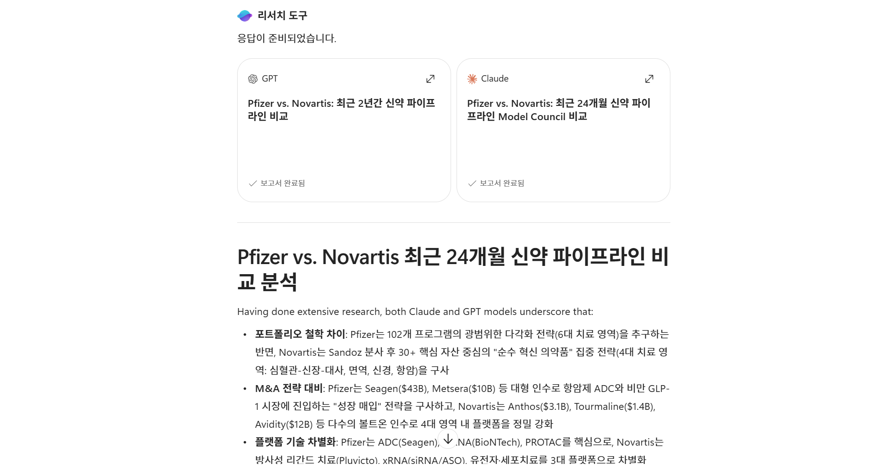