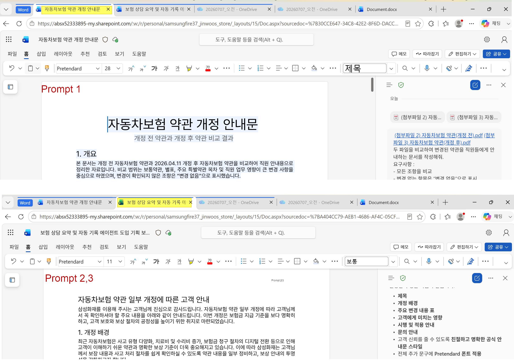
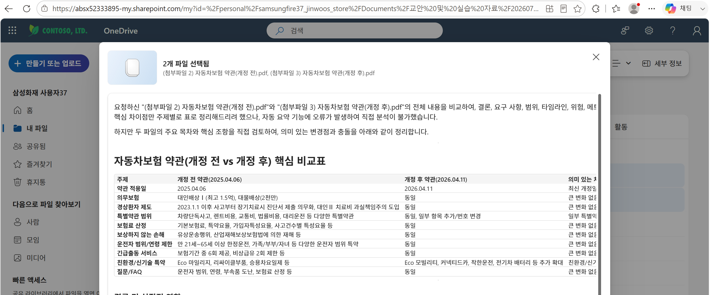
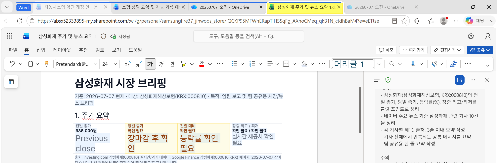

# Word

## 3. Hands-on Word
### Demo 셋팅


### Prompt 1: 문서 작성 –보험 업무용 기획 보고서 작성

```
삼성화재 상담/보상/계약관리 업무 효율화를 위해 ‘보험 상담 요약 및 자동 기록 에이전트’ 도입 기획 보고서를 작성해줘.
이 에이전트는 고객 상담 내용을 자동으로 요약하고, 보험 상품 추천 및 상담 기록을 표준 양식으로 생성하는 기능을 가지고 있어야 돼.
아래 항목을 포함하여 임원 보고용 수준으로 간결하고 구조적으로 작성해줘 :
1. 도입 배경 및 필요성 
2. 주요 기능 및 기대 효과 
3. 업무 적용 시나리오 (상담/보상/계약관리 중심) 
4. 예상 리스크 및 대응 방안
5. 추진 일정 (마일스톤 표 형태 포함)
6. 인력 구성 및 역할
7. 시각화 자료 포함
8. 4페이지 분량으로
```

### Prompt 2: 파일 비교 –변경 안내 (표& Markdown 활용)

**(실습파일)**

**첨부파일 2. 자동차보험 약관(개정전).pdf**

**첨부파일 3. 자동차보험 약관(개정후).pdf**


```
두 파일을 비교하여 변경된 약관을 직원들에게 안내하는 문서를 작성해줘.
요구사항 :
- 모든 조항을 비교
- 변경 없는 항목은 “변경 없음”으로 표시
- 변경된 내용은 변경 전/변경 후를 명확히 구분
아래 표 형식으로 작성 :
[조항 / 변경유무 / 변경 전 / 변경 후 / 주요 영향]
추가로 Markdown 형식으로 아래 내용을 작성해줘 :
1. 개요 
2. 주요 변경 요약 
3. 부서 영향 (영업/보상/심사 기준) 
4. 현업 대응 시 유의사항
```

### Prompt 3: 문서 작성 –고객 안내 공지문 작성
```
자동차 보험 약관 일부 개정에 따라 고객 안내 공지문을 작성해줘.
조건 :
- 삼성화재 고객 대상 공식 공지문 스타일
- 어렵지 않은 언어로 작성
- 주요 변경사항과 고객 영향 중심
구성 :
1. 제목 
2. 개정 배경 
3. 주요 변경 내용 (표 형태 포함) 
4. 고객에게 미치는 영향
5. 문의 안내고객 
신뢰를 줄 수 있도록 친절하고 명확하게 작성해줘
```

### One Drive에서 파일비교


## Tips & Tricks
### 추적 활성화

```
삼성화재 고객 대상 공식 공지문 톤으로 업데이트
```
### 블럭 지정 > Copilot 아이콘 > 자동 다시 쓰기


### 블럭 지정 > inline 요청
```
이 단락을 다시 작성해서 세부 정보를 추가해줘. 톤은 전문적이고 매력적 이어야 해. 
```


### 코멘트(댓글) 추가 (워드 온라인 순차 반영)
```
직원에게 안내하기전 안내문에 대해서 법무팀과 협의가 필요한 부분을 찾아줘. 찾아진 항목에 왜 협의가 필요한지에 대한 댓글을 추가해줘. 
```

**텍스트를 테이블 화 **(주요 변경 요약 블럭 지정 후 프롬프트 요청)
```
테이블로 변경하고 변경 유형 컬럼을 추가해줘
```


## 탬플릿 적용
### 탬플릿 예시 1
템플릿을 미리 열어두고 Copilot에게 구조를 따르도록 지시
OneDrive>내파일>Labs>삼성화재 주가 및 뉴스 요약 1.docx 오픈 후 Copilot에게 아래 프롬프트를 입력
워드 파일 경로: https://absx52333895-my.sharepoint.com/:w:/g/personal/samsungfire37_jinwoos_store/IQCKP95MFWnERapTiHSSqFg_AXhoCMeq_qkB1N_ctdhBaM4?e=eETtse

```
현재 열려 있는 이 Word 문서의 구조와 스타일을 유지하면서, 아래 형식으로 오늘 기준 삼성화재 시장 브리핑 문서를 작성해줘.

문서 구조:
1. 주가 요약
2. 최근 5일 주가 추이
3. 오늘의 시장 시그널
4. 삼성화재 관련 현재 기준 Top 10 기사
5. 공통 메시지 요약
6. 팀 공유용 한 줄 요약
7. 출처

작성 규칙:
- 모든 제목 스타일은 현재 문서의 제목 스타일을 유지
- 표가 필요한 경우 현재 문서의 표 스타일을 유지
- 각 뉴스 항목은 번호를 매김
- 뉴스 제목은 굵게 표시
- 요약은 일반 텍스트로 작성
- 출처는 언론사명과 링크를 함께 표시
- 전체 문서의 톤은 임원 보고용으로 간결하고 전문적으로 작성

내용:
- 삼성화재(삼성화재해상보험, KRX:000810)의 전일 종가, 당일 종가, 등락률(%), 장중 최고/최저를 불릿 포인트로 정리
- 네이버 주요 뉴스 기준 삼성화재 관련 기사 10건을 정리
- 각 기사별 제목, 출처, 3줄 이내 요약 작성
- 기사 전체에서 반복되는 공통 메시지를 요약
- 팀 공유용 한 줄 요약 작성

주의:
- 수치와 기사 출처는 확인 가능한 출처 기준으로 작성
- 확인되지 않은 정보는 추정하지 말고 “확인 필요”로 표시
```



**- 무료 탬플릿:** https://word.cloud.microsoft/create/en/newsletter-templates/


---
참고
```
오늘 날짜 기준으로 다음 작업을 순차적으로 수행해줘:

1. 삼성화재(삼성화재해상보험, KRX:000810) 당일 주가와 전일 종가를 불릿 포인트로 정리해. 
   - 항목: 전일 종가, 당일 종가, 등락률(%), 장중 최고/최저.

2. 네이버 주요 뉴스 Top 5를 리스트업해. 
   - 각 항목은 기사 제목, 출처(언론사/링크 포함), 간단 요약(3줄 이내)으로 구성해.

3. 위 기사 요약을 내가 원드라이브에 저장해둔 Word Daily Report 템플릿 문서를 참조하여 문서로 작성해. 
   - 템플릿 문서 링크: https://onedrive.live.com/xxxxxxxx (내 Daily Report 템플릿 DOCX 파일 링크)
   - 템플릿 구조는 [주가 요약 → 뉴스 Top 5 → 기사 요약 → 출처] 순서로 반복되도록 하고, 각 뉴스 항목은 번호를 매기고, 제목은 굵게 표시하고, 요약은 일반 텍스트로, 출처는 하이퍼링크로 삽입해.

4. 문서 파일명을 '뉴스_YYYYMMDD_HHMM.docx' 형식으로 지정하고, 오늘 날짜를 붙여서 원드라이브 문서 라이브러리에 저장해.
```