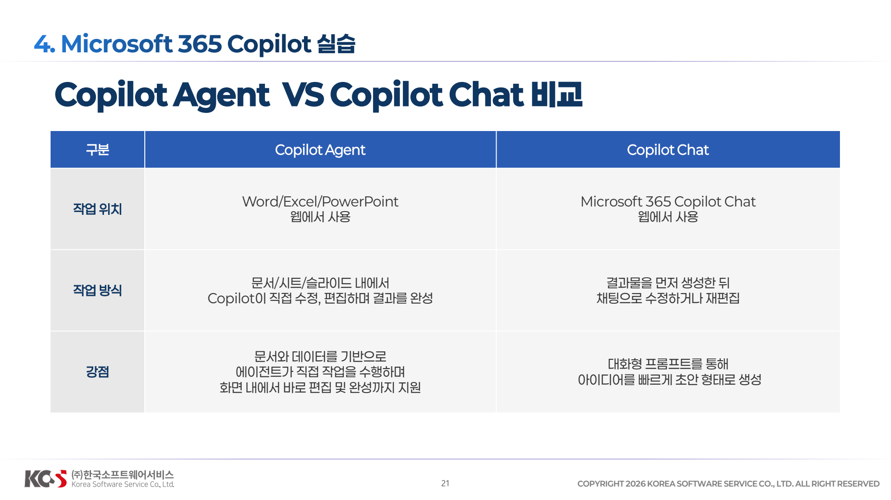
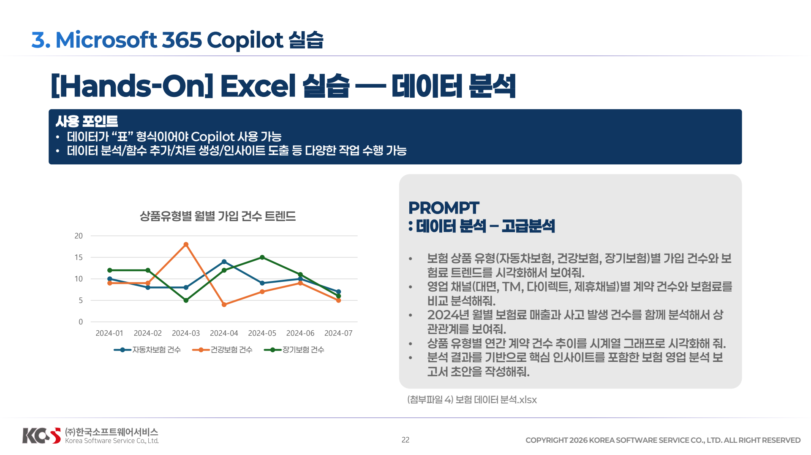
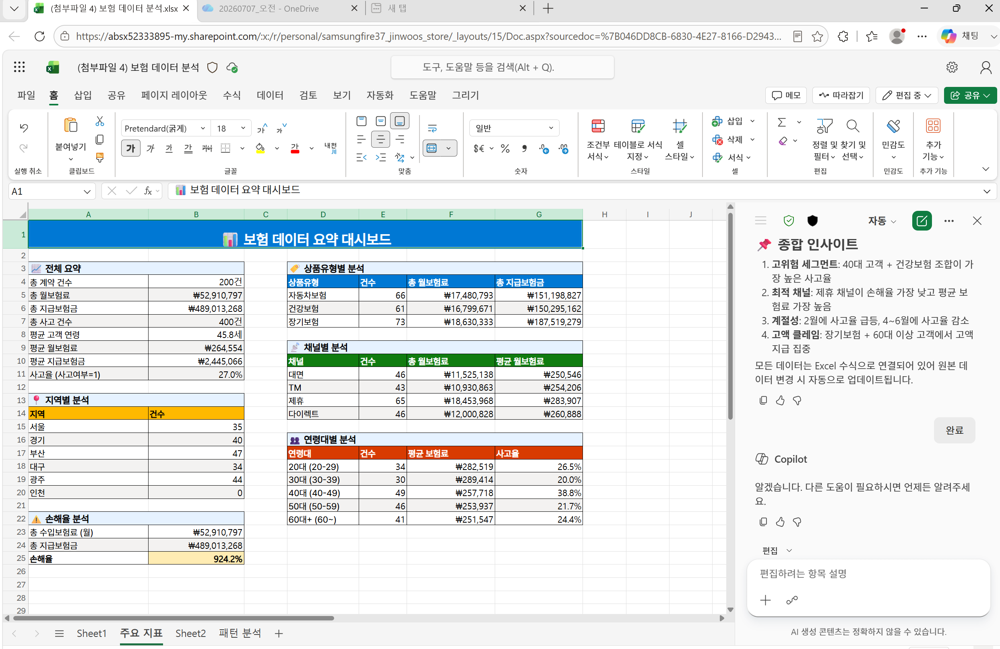
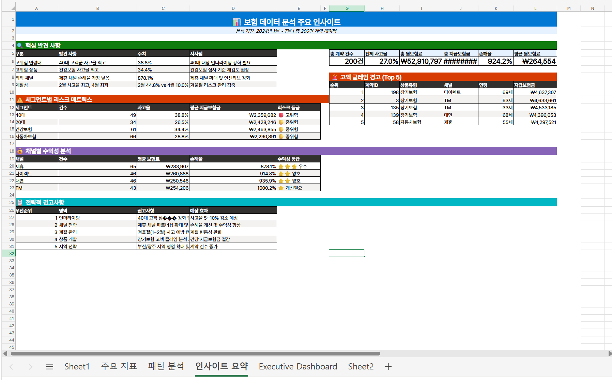
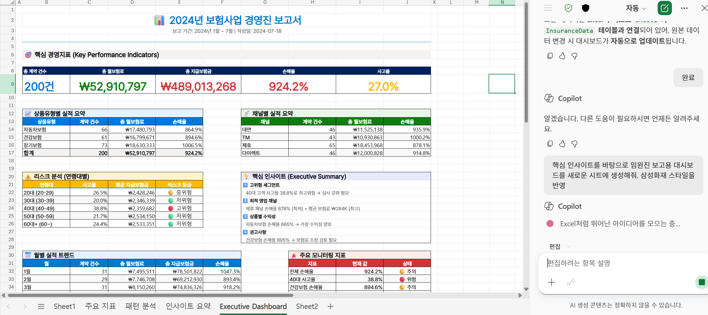
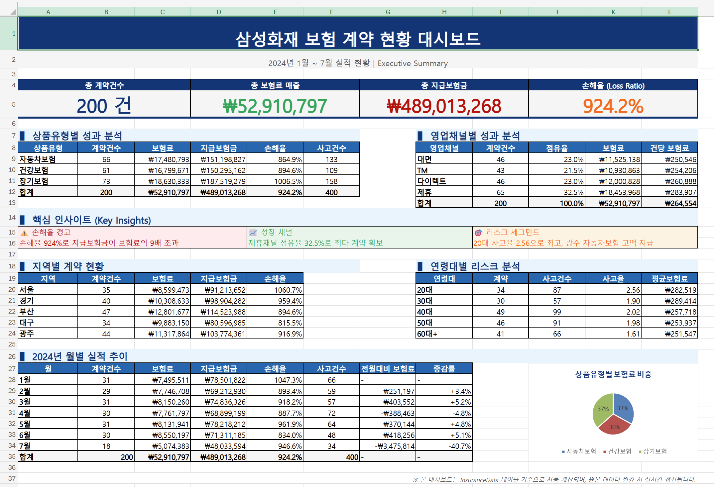
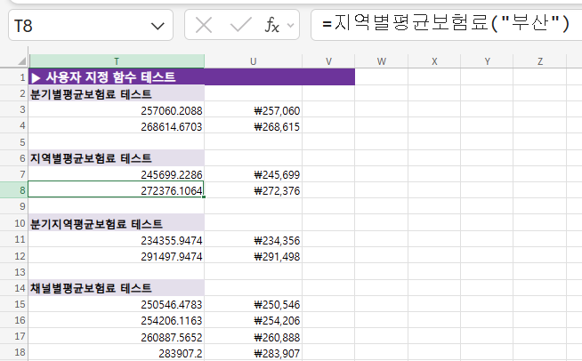
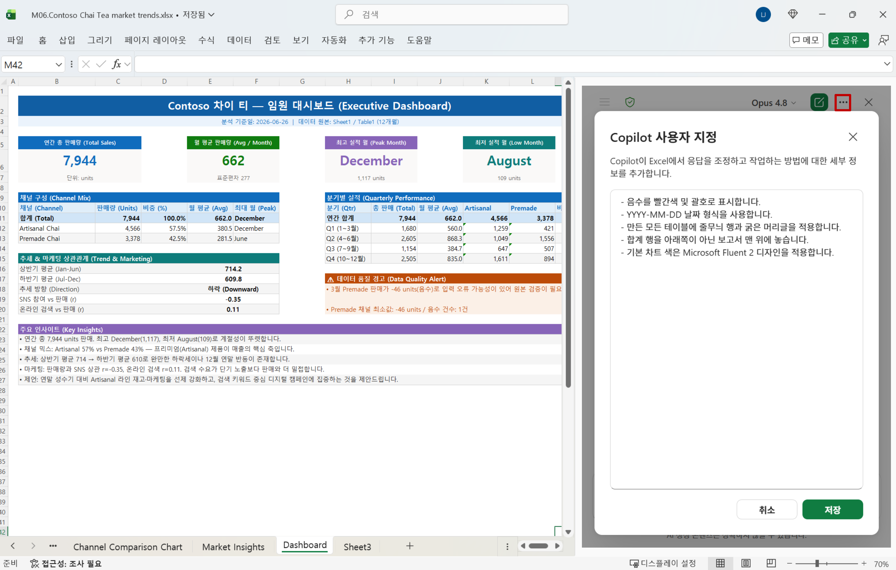

# Excel

## 3. Hands-on Excel

### 기본 설명
참고: 편집, 채팅 및 계획 모드 중에서 선택 Excel의 Copilot는 편집, 계획 또는 채팅의 세 가지 모드를 제공합니다. 기본적으로 Excel의 Copilot는 편집 모드로 열립니다. 편집 모드에서 Excel의 Copilot는 요청에 따라 통합 문서를 직접 편집할 수 있습니다. 계획 모드를 사용하여 통합 문서를 편집하기 전에 계획을 세우고 채팅 모드를 사용하여 채팅 내에 Copilot 응답을 포함하도록 합니다.
- **편집 모드** 허용 은 데이터 재구성, 시트 병합 또는 여러 요소를 사용하여 보고서 작성과 같은 복잡한 다단계 작업을 지원합니다.
- **계획 모드**는 작업을 완료하는 구조화된 접근 방식을 만듭니다. Copilot는 즉각적인 작업 대신 계획을 생성하므로 시작하기 전에 접근 방식을 검토하고 확인할 수 있습니다.
- **채팅 전용** 모드는 통합 문서를 변경하지 않고 통합 문서 데이터를 분석하고 인사이트를 제공할 수 있습니다.


### Prompt 1: 데이터 분석 – 기본

**(첨부파일 4) 보험 데이터 분석.xlsx**

```
2024년도에 접수된 자동차보험 사고 건수와 총 지급 보험금을 알려줘.
```
```
지급보험금 컬럼을 생성해서 지급금액 = 수리비 + 치료비로 계산해줘.
```
```
지급보험금이 400만원 이상인 경우 해당 행 전체를 강조 표시(노란색)해줘.
```
```
상품 유형(자동차보험, 건강보험, 장기보험)별 총 지급보험금과 사고 건수를 요약해줘.
```
### Prompt 2: 데이터 분석 – 고급분석

**(첨부파일 4) 보험 데이터 분석.xlsx**

```
보험 상품 유형(자동차보험, 건강보험, 장기보험)별 가입 건수와 보험료 트렌드를 시각화해서 보여줘.
```
```
영업 채널(대면, TM, 다이렉트, 제휴채널)별 계약 건수와 보험료를 비교 분석해줘.
```
```
2024년 월별 보험료 매출과 사고 발생 건수를 함께 분석해서 상관관계를 보여줘.
```
```
상품 유형별 연간 계약 건수 추이를 시계열 그래프로 시각화해 줘.
```
```
분석 결과를 기반으로 핵심 인사이트를 포함한 보험 영업 분석 보고서 초안을 작성해줘.
```

## Tips & Tricks
### 주요 지표에 대한 개요
```
InsuranceData 테이블의 데이터 세트를 요약하고 주요 지표에 대한 개요를  새로운 sheet에 제공해줘.
```


### 주요 패턴 분석
```
InsuranceData 테이블의 데이터에서 나타나는 주요 패턴을 보여주는 테이블을 새로운 Sheet에 생성해줘.
```


### 주요 인사이트 도출
```
데이터 분석에서 얻은 주요 인사이트를 요약하여 새로운 Sheet에 제시하세요
```


### 대시보드 생성
```
핵심 인사이트를 바탕으로 임원진 보고용 대시보드를 새로운 시트에 생성해줘. 삼성화재 스타일을 반영
```


**삼성화재 스타일반영한 대시보드**


### 사용자 지정 함수 생성
```
분기별/지역별 평균 보험료를 계산하는 사용자 지정 함수를 생성해 줘.
```
```
영업채널별 평균 보험료를 계산하는 사용자 지정 함수를 생성해 줘.
```


### 분석 결과 공유용 이메일 작성 요청
```
2024년 보험 데이터 분석 결과를 이메일로 보낼 수 있도록 초안 작성해줘. 수신자는 팀원이며, 분석 결과 요약과 핵심 인사이트를 포함하고, 시각화 자료를 첨부하도록 안내해줘.
```

### (Optional) 개인 설정 검토
개인 설정을 사용하면 Excel에서 Copilot를 사용자 지정하여 기본 설정에 따라 결과를 반환할 수 있습니다. 개인 설정 기본 설정을 하면 **계정에 저장되고 Excel 세션의 모든 통합 문서 및 Copilot에 적용**됩니다.
1. Copilot 창에서 설정 메뉴(오른쪽 위 모서리에 있는 ... )를 선택합니다.
2. 개인 설정을 선택합니다. 결과를 원하는 방법을 설정합니다. 예를 들어, 개인 설정을 사용하여 **Copilot이 결과를 반환할 때 특정 형식이나 스타일을 적용하도록 지정**할 수 있습니다.
대시보드의 색상이 적용되어 작성됩니다.

```
- 음수를 빨간색 및 괄호로 표시합니다.
- YYYY-MM-DD 날짜 형식을 사용합니다.
- 만든 모든 테이블에 줄무늬 행과 굵은 머리글을 적용합니다.
- 합계 행을 아래쪽이 아닌 보고서 맨 위에 놓습니다.
- 바탕색은 #FFFFFF 적용합니다.
- White 기본 차트 색은 Microsoft Fluent 2 디자인을 적용합니다.
- 폰트는 Pretendard만 사용합니다. 
```