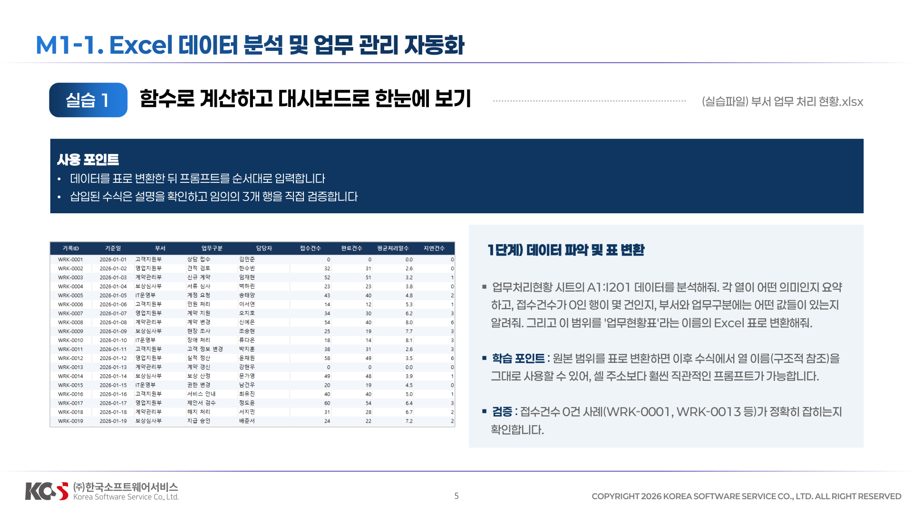
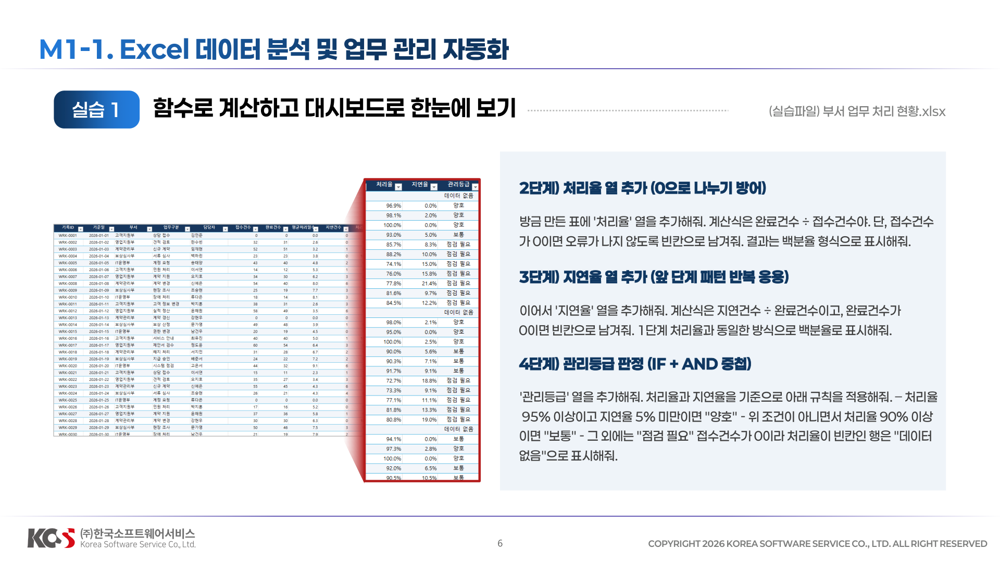
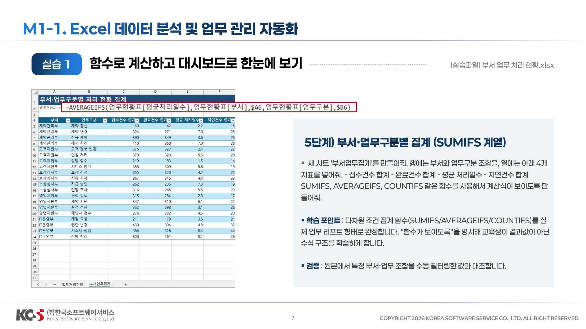
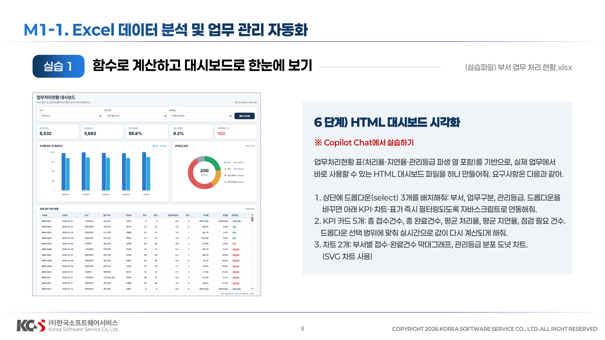
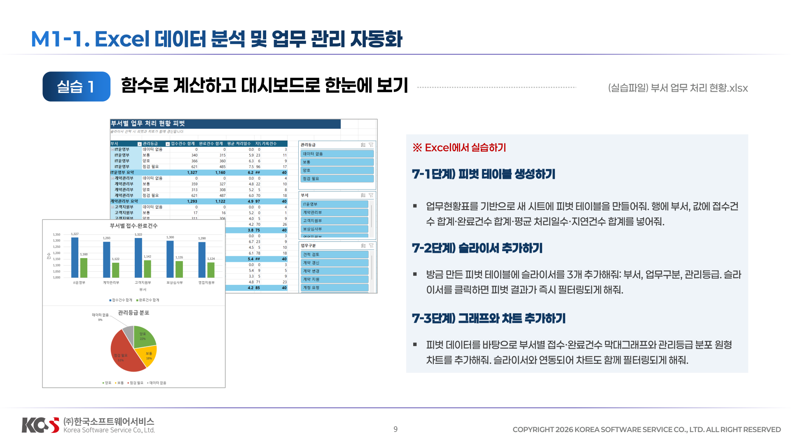
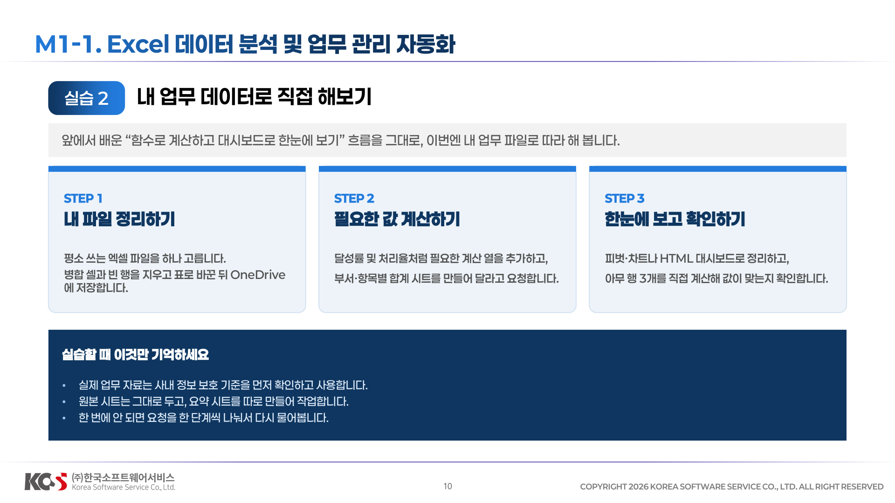

## M1-1. Excel 데이터 분석 및 업무 관리 자동화


**1단계:** `업무처리현황 시트의 A1:I201 데이터를 분석해줘. 각 열이 어떤 의미인지 요약하고, 접수건수가 0인 행이 몇 건인지, 부서와 업무구분에는 어떤 값들이 있는지 알려줘. 그리고 이 범위를 '업무현황표'라는 이름의 Excel 표로 변환해줘`


**2단계:** `방금 만든 표에 '처리율' 열을 추가해줘. 계산식은 완료건수 ÷접수건수야. 단, 접수건수가 0이면 오류가 나지 않도록 빈칸으로 남겨줘. 결과는 백분율 형식으로 표시해줘.`

**3단계:** `이어서 '지연율' 열을 추가해줘. 계산식은 지연건수 ÷완료건수이고, 완료건수가 0이면 빈칸으로 남겨줘. 1단계 처리율과 동일한 방식으로 백분율로 표시해줘.`

**4단계:** 
```
'관리등급' 열을 추가해줘. 처리율과 지연율을 기준으로 아래 규칙을 적용해줘. 
–처리율 95% 이상이고 지연율 5% 미만이면 "양호" 
-위 조건이 아니면서 처리율 90% 이상이면 "보통" 
-그 외에는 "점검 필요" 
접수건수가 0이라 처리율이 빈칸인 행은 "데이터 없음"으로 표시해줘.
```



**5단계:** 
```
새 시트 '부서업무집계'를 만들어줘. 행에는 부서와 업무구분 조합을, 열에는 아래 4개 지표를 넣어줘. 
-접수건수 합계 
-완료건수 합계 
-평균 처리일수 
-지연건수 합계 
SUMIFS, AVERAGEIFS, COUNTIFS 같은 함수를 사용해서 계산식이 보이도록 만들어줘.
```


**6단계:** 

```
업무처리현황 표(처리율·지연율·관리등급 파생 열 포함)를 기반으로, 실제 업무에서 바로 사용할 수 있는 HTML 대시보드 파일을 하나 만들어줘. 요구사항은 다음과 같아. 
1. 상단에 드롭다운(select) 3개를 배치해줘: 부서, 업무구분, 관리등급. 드롭다운을 바꾸면 아래 KPI·차트·표가 즉시 필터링되도록 자바스크립트로 연동해줘. 
2. KPI 카드 5개: 총 접수건수, 총 완료건수, 평균 처리율, 평균 지연율, 점검 필요 건수. 드롭다운 선택 범위에 맞춰 실시간으로 값이 다시 계산되게 해줘. 
3. 차트 2개: 부서별 접수·완료건수 막대그래프, 관리등급 분포 도넛 차트. (SVG 차트사용)
```



**7-1단계 피벗 테이블생성하기**

`업무현황표를 기반으로 새 시트에 피벗 테이블을 만들어줘. 행에 부서, 값에 접수건수 합계·완료건수 합계·평균 처리일수·지연건수 합계를 넣어줘.`

**7-2단계) 슬라이서 추가하기**

`방금 만든 피벗 테이블에 슬라이서를 3개 추가해줘: 부서, 업무구분, 관리등급. 슬라이서를 클릭하면 피벗 결과가 즉시 필터링되게 해줘`

**7-3단계) 그래프와 차트 추가하기**

`피벗 데이터를 바탕으로 부서별 접수·완료건수 막대그래프와 관리등급 분포 원형 차트를 추가해줘. 슬라이서와 연동되어 차트도 함께 필터링되게 해줘.`

