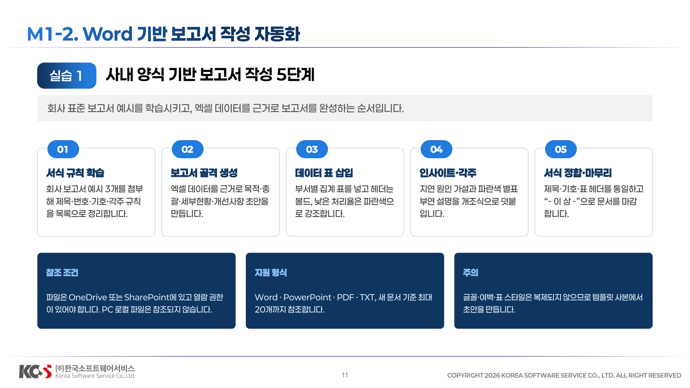
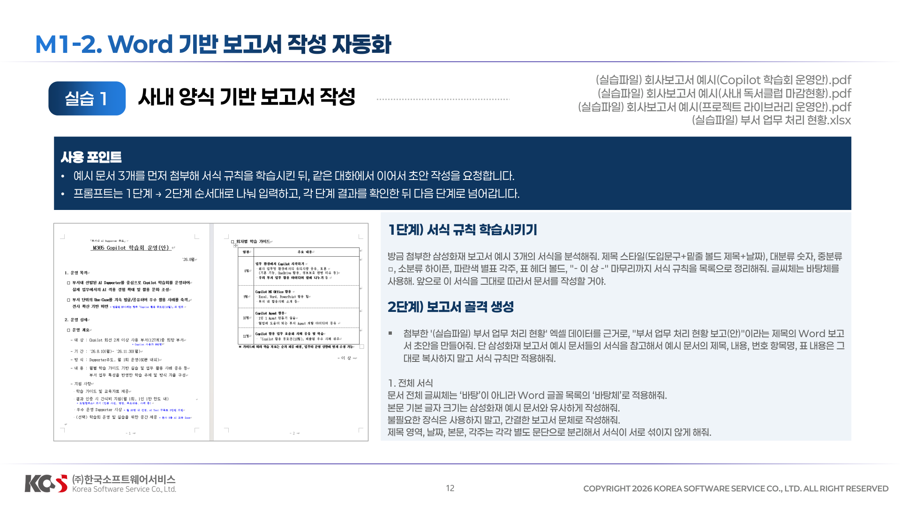
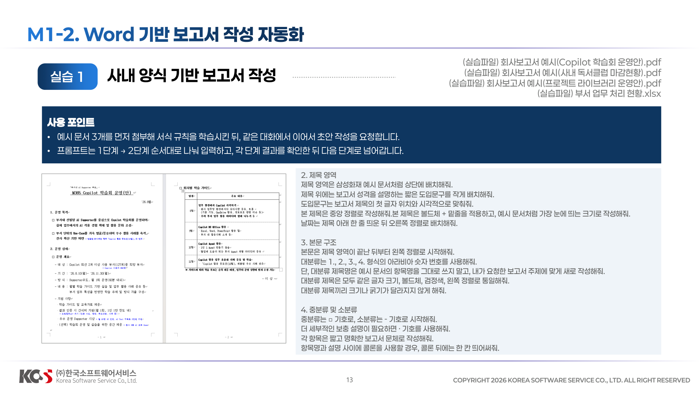
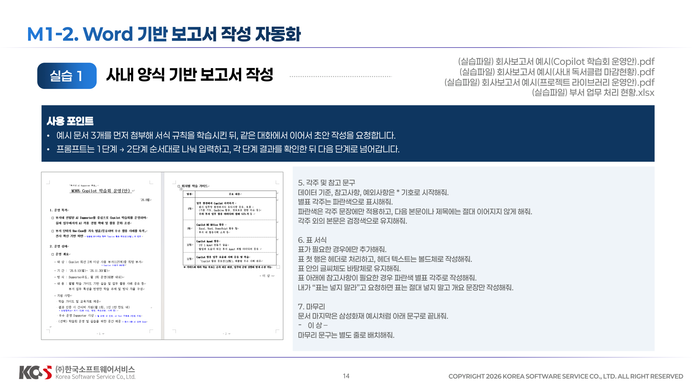
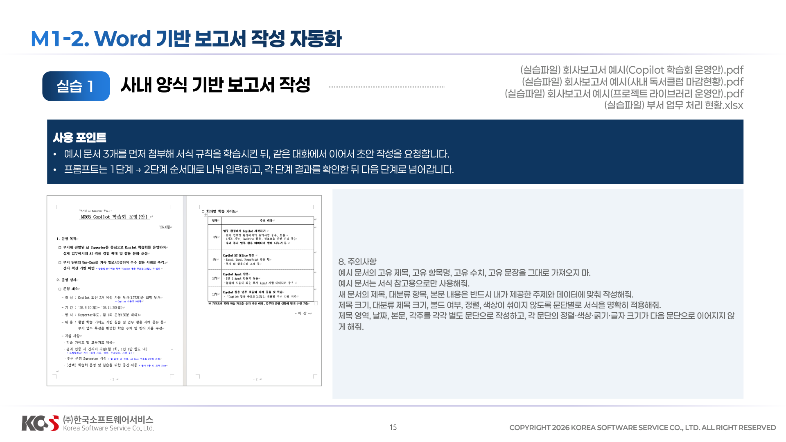
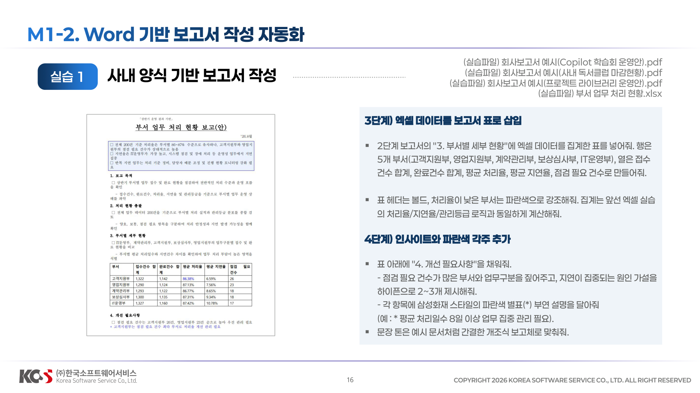
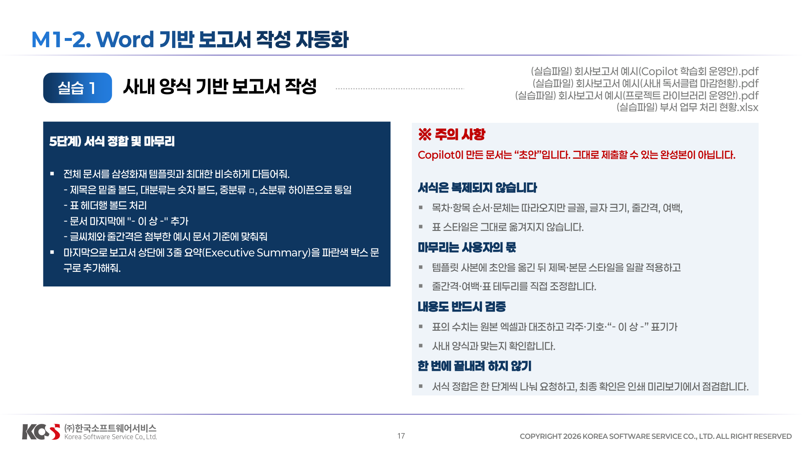
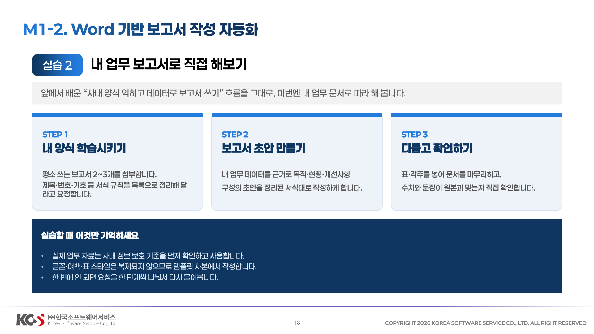

## M1-2. Word 기반 보고서 작성 자동화





**1단계) 서식 규칙 학습시키기**
    ```
    방금 첨부한 삼성화재 보고서 예시 3개의 서식을 분석해줘. 제목 스타일(도입문구+밑줄 볼드 제목+날짜), 대분류 숫자, 중분류, 소분류 하이픈, 파란색 별표 각주, 표 헤더 볼드, "-이 상 -" 마무리까지 서식 규칙을 목록으로 정리해줘. 글씨체는 바탕체를 사용해. 앞으로 이 서식을 그대로 따라서 문서를 작성할 거야.
    ```

**2단계) 보고서 골격 생성**
```
첨부한 '(실습파일) 부서 업무 처리 현황' 엑셀 데이터를 근거로 "부서 업무 처리 현황 보고(안)"이라는 제목의 Word 보고서 초안을 만들어줘. 
단 삼성화재 보고서 예시 문서들의 서식을 참고해서 예시 문서의 제목, 내용, 번호 항목명, 표 내용은 그대로 복사하지 말고 서식 규칙만 적용해줘. 

1. 전체 서식
문서 전체 글씨체는 ‘바탕’이 아니라 Word 글꼴 목록의 ‘바탕체’로 적용해줘.
본문 기본 글자 크기는 삼성화재 예시 문서와 유사하게 작성해줘. 
불필요한 장식은 사용하지 말고, 간결한 보고서 문체로 작성해줘. 
제목 영역, 날짜, 본문, 각주는 각각 별도 문단으로 분리해서 서식이 서로 섞이지 않게 해줘.

2. 제목 영역
제목 영역은 삼성화재 예시 문서처럼 상단에 배치해줘.
제목 위에는 보고서 성격을 설명하는 짧은 도입문구를 작게 배치해줘.
도입문구는 보고서 제목의 첫 글자 위치와 시각적으로 맞춰줘.
본 제목은 중앙 정렬로 작성해줘.본 제목은 볼드체 + 밑줄을 적용하고, 예시 문서처럼 가장 눈에 띄는 크기로 작성해줘.
날짜는 제목 아래 한 줄 띄운 뒤 오른쪽 정렬로 배치해줘.

3. 본문 구조
본문은 제목 영역이 끝난 뒤부터 왼쪽 정렬로 시작해줘.
대분류는 1., 2., 3., 4. 형식의 아라비아 숫자 번호를 사용해줘.
단, 대분류 제목명은 예시 문서의 항목명을 그대로 쓰지 말고, 내가 요청한 보고서 주제에 맞게 새로 작성해줘.
대분류 제목은 모두 같은 글자 크기, 볼드체, 검정색, 왼쪽 정렬로 통일해줘.
대분류 제목끼리 크기나 굵기가 달라지지 않게 해줘.

4. 중분류 및 소분류
중분류는 □ 기호로, 소분류는 -기호로 시작해줘.
더 세부적인 보충 설명이 필요하면 · 기호를 사용해줘.
각 항목은 짧고 명확한 보고서 문체로 작성해줘.
항목명과 설명 사이에 콜론을 사용할 경우, 콜론 뒤에는 한 칸 띄어써줘.

5. 각주 및 참고 문구
데이터 기준, 참고사항, 예외사항은 * 기호로 시작해줘.
별표 각주는 파란색으로 표시해줘.
파란색은 각주 문장에만 적용하고, 다음 본문이나 제목에는 절대 이어지지 않게 해줘.
각주 외의 본문은 검정색으로 유지해줘.

6. 표 서식
표가 필요한 경우에만 추가해줘.
표 첫 행은 헤더로 처리하고, 헤더 텍스트는 볼드체로 작성해줘.
표 안의 글씨체도 바탕체로 유지해줘.
표 아래에 참고사항이 필요한 경우 파란색 별표 각주로 작성해줘.
내가 “표는 넣지 말라”고 요청하면 표는 절대 넣지 말고 개요 문장만 작성해줘.

7. 마무리
문서 마지막은 삼성화재 예시처럼 아래 문구로 끝내줘.
-이 상 
마무리 문구는 별도 줄로 배치해줘.

8. 주의사항
예시 문서의 고유 제목, 고유 항목명, 고유 수치, 고유 문장을 그대로 가져오지 마.
예시 문서는 서식 참고용으로만 사용해줘.
새 문서의 제목, 대분류 항목, 본문 내용은 반드시 내가 제공한 주제와 데이터에 맞춰 작성해줘.
제목 크기, 대분류 제목 크기, 볼드 여부, 정렬, 색상이 섞이지 않도록 문단별로 서식을 명확히 적용해줘.
제목 영역, 날짜, 본문, 각주를 각각 별도 문단으로 작성하고, 각 문단의 정렬·색상·굵기·글자 크기가 다음 문단으로 이어지지 않게 해줘
```


**3단계) 엑셀 데이터를 보고서 표로 삽입**
    ```
    - 2단계 보고서의 "3. 부서별 세부 현황"에 엑셀 데이터를 집계한 표를 넣어줘. 행은 5개 부서(고객지원부, 영업지원부, 계약관리부, 보상심사부, IT운영부), 열은 접수
    건수 합계, 완료건수 합계, 평균 처리율, 평균 지연율, 점검 필요 건수로 만들어줘. 
    - 표 헤더는 볼드, 처리율이 낮은 부서는 파란색으로 강조해줘. 집계는 앞선 엑셀 실습의 처리율/지연율/관리등급 로직과 동일하게 계산해줘.
    ```

***4단계) 인사이트와 파란색 각주 추가***
    ```
    - 표 아래에 "4. 개선 필요사항"을 채워줘. -점검 필요 건수가 많은 부서와 업무구분을 짚어주고, 지연이 집중되는 원인 가설을 하이픈으로 2~3개 제시해줘. -각 항목에 삼성화재 스타일의 파란색 별표(*) 부연 설명을 달아줘 (예 : * 평균 처리일수 8일 이상 업무 집중 관리 필요). 
    - 문장 톤은 예시 문서처럼 간결한 개조식 보고체로 맞춰줘.
    ```


