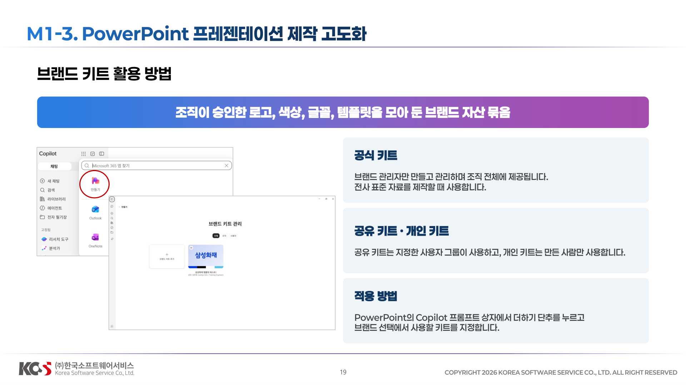
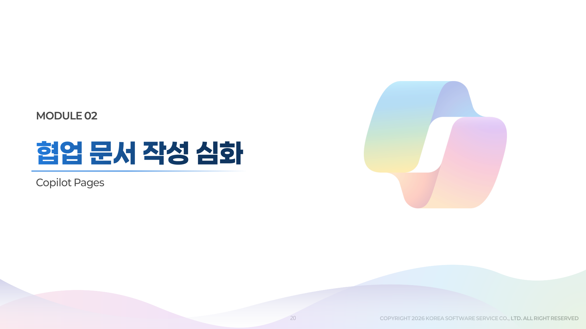
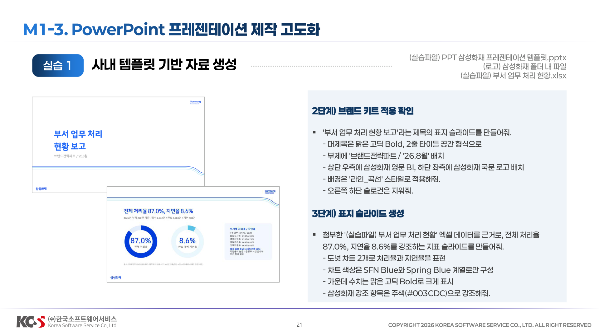

# M1-3. PowerPoint 프레젠테이션 제작 고도화

<!--


## 2-3 단계

**2단계) 브랜드 키트 적용 확인**
```
'부서 업무 처리 현황 보고'라는 제목의 표지 슬라이드를 만들되 [(실습파일) PPT 삼성화재 프레젠테이션 템플릿.pptx] 을 기반으로 작성해줘. 선택한 브랜드 키트의 로고 사용.
-대제목은 맑은고딕Bold, 2줄 타이틀 공간 형식으로
-부제에 '브랜드전략파트 / '26.8월' 배치
-상단 우측에 삼성화재 영문 BI, 하단 좌측에 삼성화재 국문 로고 배치
-배경은 탬플릿의 '라인_곡선' 스타일로 적용해줘.
-오른쪽 하단 슬로건은 지워줘.
```
-->

## 1단계 표지 슬라이드 생성
1. Powerpoint online으로 빈 PPT 열기

```
첨부한 /(실습파일) 부서 업무 처리 현황] 엑셀 데이터를 근거로, 전체 처리율 87.0%, 지연율 8.6%를 강조하는 지표 슬라이드를 만들어줘. 
-도넛 차트 2개로 처리율과 지연율을 표현 
-차트 색상은 SFN Blue와 Spring Blue 계열로만 구성 
-가운데 수치는 맑은고딕Bold로 크게 표시 
-삼성화재 강조 항목은 주색(#003CDC)으로 강조해줘.
-탬플릿은 /(실습파일) PPT 삼성화재 프레젠테이션 템플릿] 의 '라인_곡선' 스타일로 적용
```
    
`2 page 오른쪽에 부서별 처리율/지연율을 첨부했던 엑셀데이터를 참고해서 추가해줘`

## 2-3 단계

**2단계) 부서별 현황 표 슬라이드**
```
5개 부서(고객지원부, 영업지원부, 계약관리부, 보상심사부, IT운영부)의 접수건수, 완료건수, 처리율, 지연율, 점검필요 건수를 담은 표 슬라이드를 만들어줘. 
-헤더행은 SFN Blue 배경에 흰색 글씨 
-처리율 최저 부서 행은 Spring Blue로 강조 
-폰트는 본문 맑은고딕Regular, 수치 강조는 맑은고딕Bold로
```

**3단계) 개선 방향 슬라이드 (그래픽 모티브)**
```
'하반기 개선 방향' 슬라이드를 만들어줘.-IT운영부 처리일수 장기화, 고객지원부 점검필요 다발 등 핵심 3가지를 카드형으로 만들어줘.
-로고는 템플릿 기본 위치 유지, 우측 하단 슬로건은 삭제
-배경은 '채움_직선' 스타일, 포인트 색은 Spring Blue로 통일해줘
```

## Tips (Desktop App에서)
**Skills**

-**create-interactive-slide**: `/ 3페이지 테이블을 기준으로 인터랙티브한 슬라이드를 만들어줘. 합계와 필터 표시.  바탕의 템플릿과 디자인은 페이지의 디자인을 그대로 유지해서 새롭게 슬라이드를 생성해서 원본 아래에 배치`

- **원본 데이터 업데이트 후**: `원본 소스 변경으로 4페이지 업데이트` 
