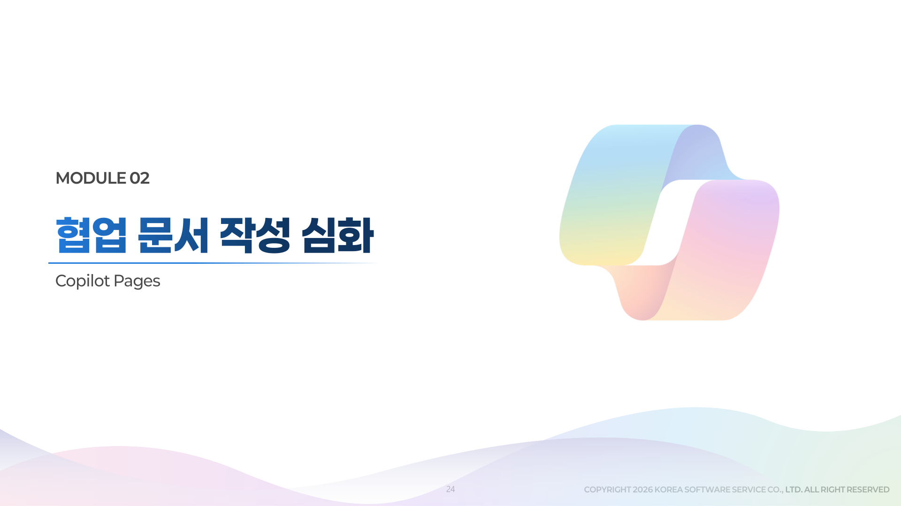
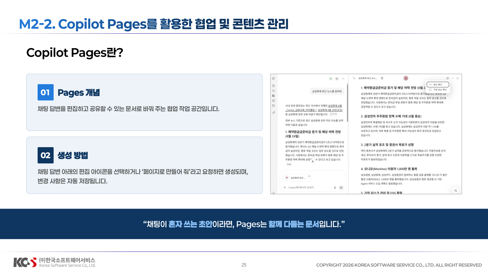
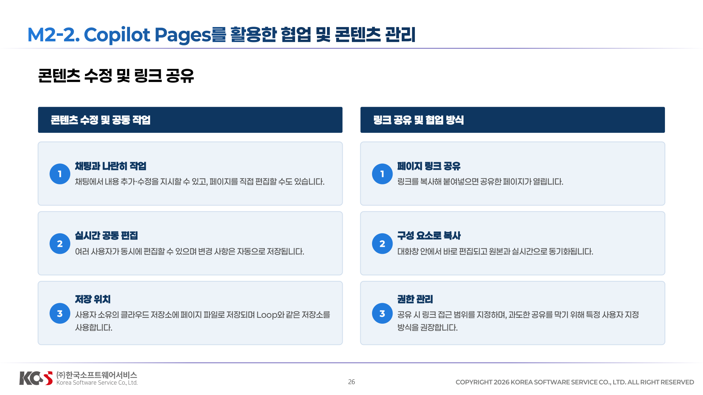
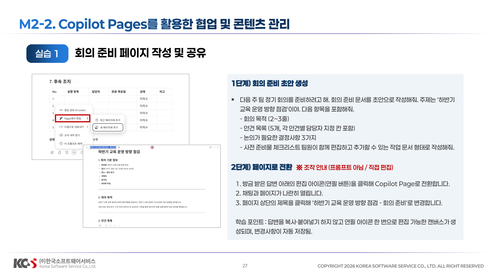
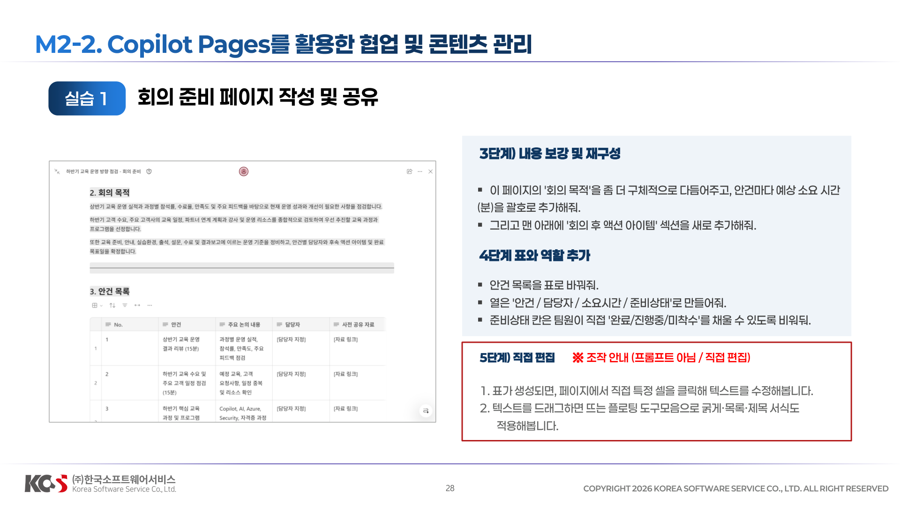
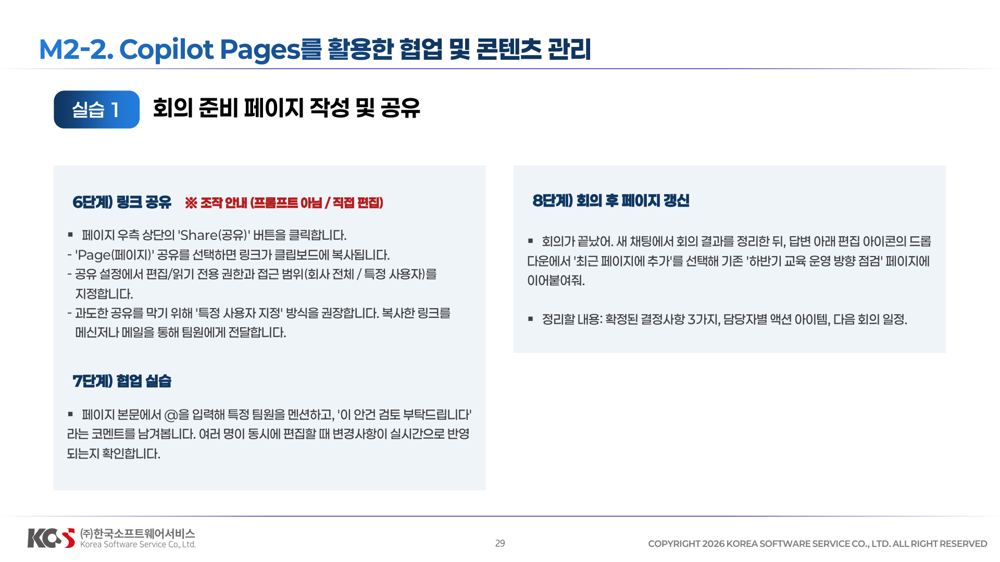

## 02 협업 문서 작성 심화


## Pages 개념




## M2-2. Copilot Pages를 활용한 협업 및 콘텐츠 관리


**1단계) 회의 준비 초안 생성**
```
다음 주 팀 정기 회의를 준비하려고 해. 회의 준비 문서를 초안으로 작성해줘. 
주제는 '하반기 교육 운영 방향 점검'이야. 
다음 항목을 포함해줘. 
-회의 목적 (2~3줄) 
-안건 목록 (5개, 각 안건별 담당자 지정 칸 포함) 
-논의가 필요한 결정사항 3가지 
-사전 준비물 체크리스트 팀원이 함께 편집하고 추가할 수 있는 작업 문서 형태로 작성해줘.
```

**2단계) 페이지로 전환※ 조작 안내 (프롬프트 아님 / 직접 편집)**
1. 방금 받은 답변 아래의 편집 아이콘(연필 버튼)을 클릭해 Copilot Page로 전환합니다. 
2. 채팅과 페이지가 나란히 열립니다. 
3. 페이지 상단의 제목을 클릭해 '하반기 교육 운영 방향 점검 -회의 준비'로 변경합니다.
학습 포인트 : 답변을 복사·붙여넣기 하지 않고 연필 아이콘 한 번으로 편집 가능한 캔버스가 생성되며, 변경사항이 자동 저장됨.



**3단계) 내용 보강 및 재구성**
```
- 이 페이지의 '회의 목적'을 좀 더 구체적으로 다듬어주고, 안건마다 예상 소요 시간(분)을 괄호로 추가해줘. 
- 그리고 맨 아래에 '회의 후 액션 아이템' 섹션을 새로 추가해줘.
```
**4단계 표와 역할 추가**
```
- 안건 목록을 표로 바꿔줘. 
- 열은 '안건 / 담당자 / 소요시간 / 준비상태'로 만들어줘. 
- 준비상태 칸은 팀원이 직접 '완료/진행중/미착수'를 채울 수 있도록 비워둬.
```

**5단계) 직접 편집 ※ 조작 안내 (프롬프트 아님 / 직접 편집)**
1. 표가 생성되면, 페이지에서 직접 특정 셀을 클릭해 텍스트를 수정해봅니다. 
2. 텍스트를 드래그하면 뜨는 플로팅 도구모음으로 굵게·목록·제목 서식도 적용해봅니다.




