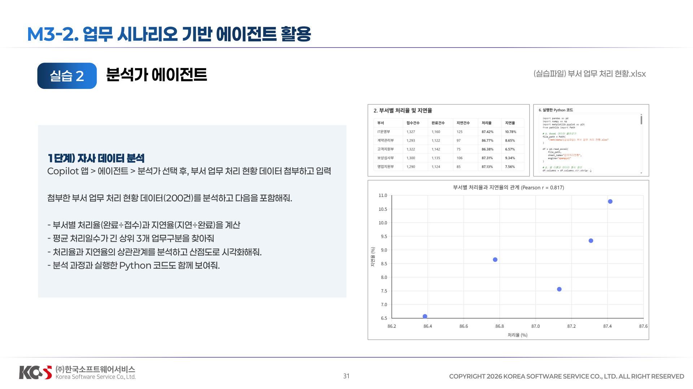
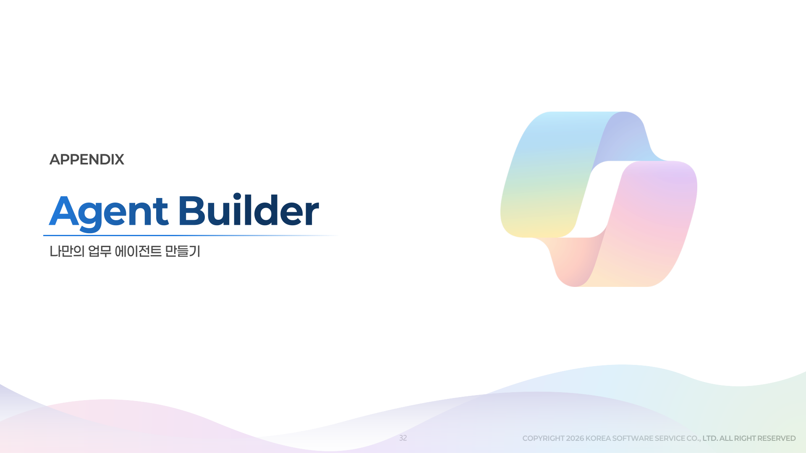
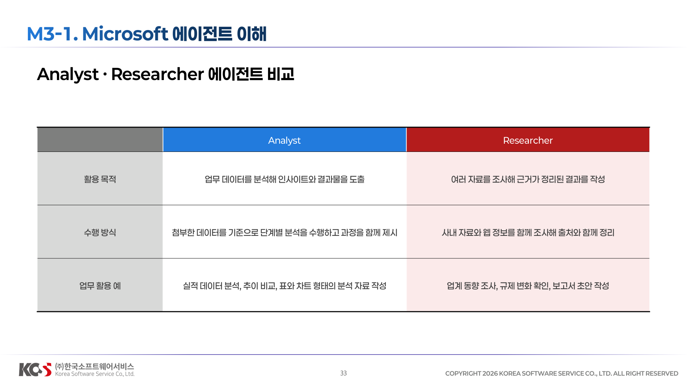
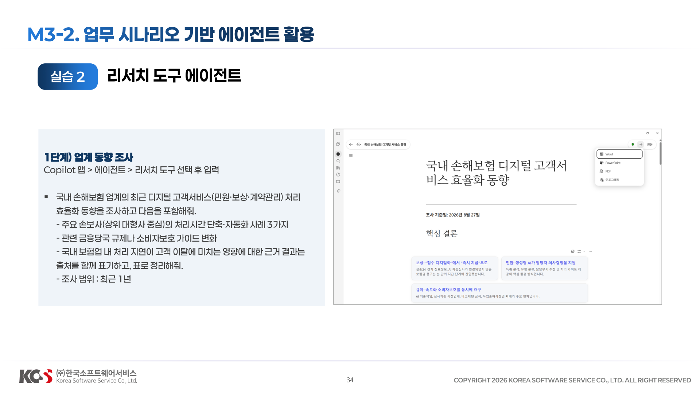
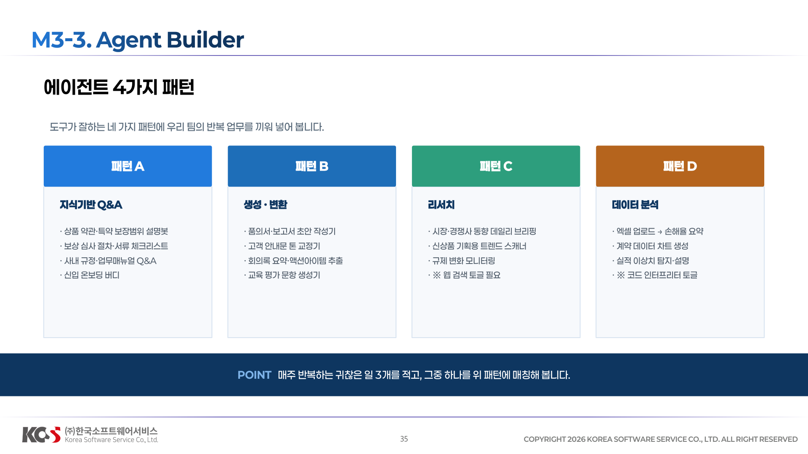

# 03 에이전트 활용


## M3-1. Microsoft 에이전트 이해




## 리서치 도구: 업계 동향 조사


**1단계) 업계 동향 조사**
Copilot 앱 > 에이전트 > 리서치 도구 선택 후 입력

```
국내 손해보험 업계의 최근 디지털 고객서비스(민원·보상·계약관리) 처리 효율화 동향을 조사하고 다음을 포함해줘. 
-주요 손보사(상위 대형사 중심)의 처리시간 단축·자동화 사례 3가지 
-관련 금융당국 규제나 소비자보호 가이드 변화 
-국내 보험업 내 처리 지연이 고객 이탈에 미치는 영향에 대한 근거 결과는 출처를 함께 표기하고, 표로 정리해줘.
-조사 범위 : 최근 1년
```

## 분석가: 데이터 분석 및 시각화

**1단계) 자사 데이터 분석**
Copilot 앱 > 에이전트 > 분석가 선택 후, 부서 업무 처리 현황 데이터 첨부하고 입력
```
첨부한 부서 업무 처리 현황 데이터(200건)를 분석하고 다음을 포함해줘. 
-부서별 처리율(완료÷접수)과 지연율(지연÷완료)을 계산 
-평균 처리일수가 긴 상위 3개 업무구분을 찾아줘 
-처리율과 지연율의 상관관계를 분석하고 산점도로 시각화해줘. 
-분석 과정과 실행한 Python 코드도 함께 보여줘
```