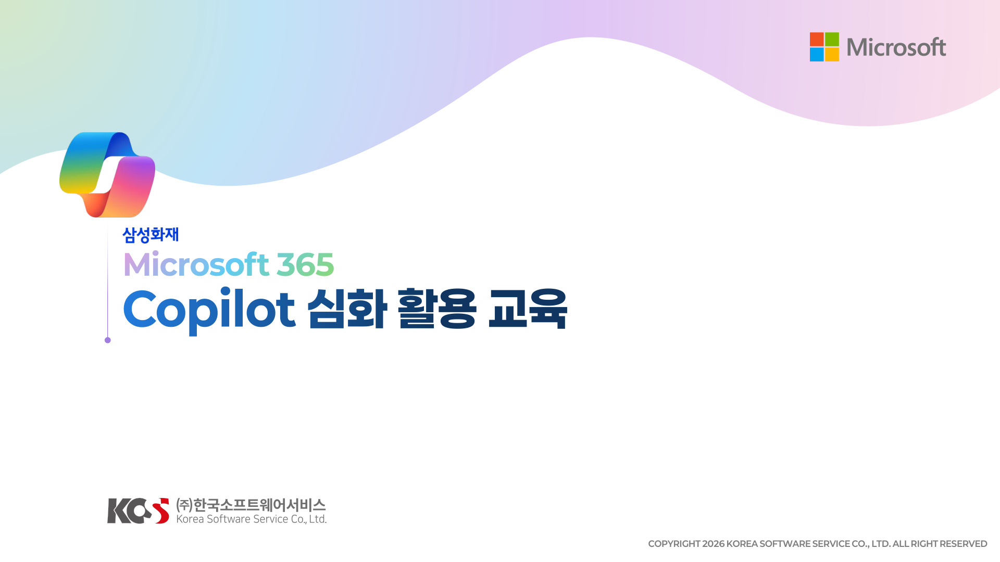
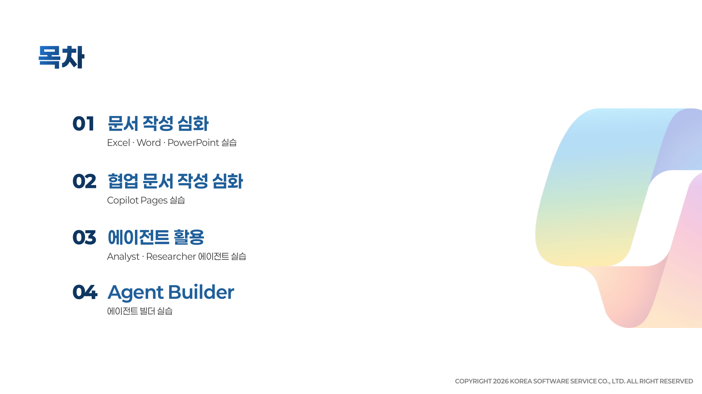
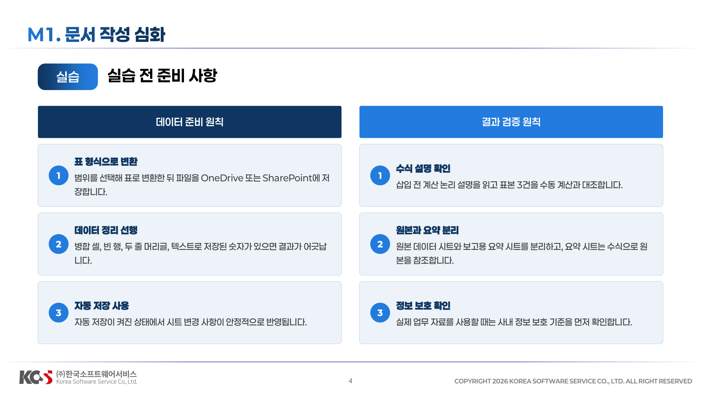
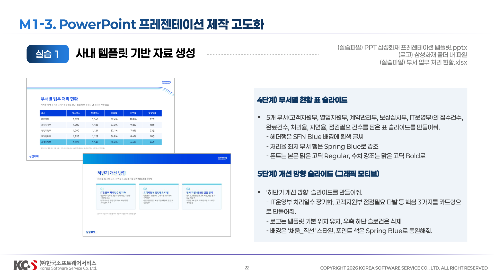
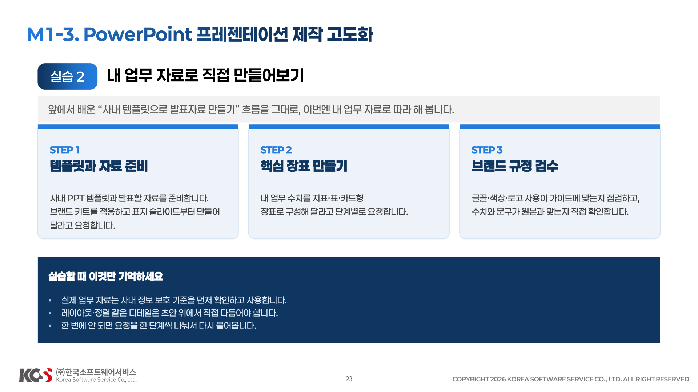
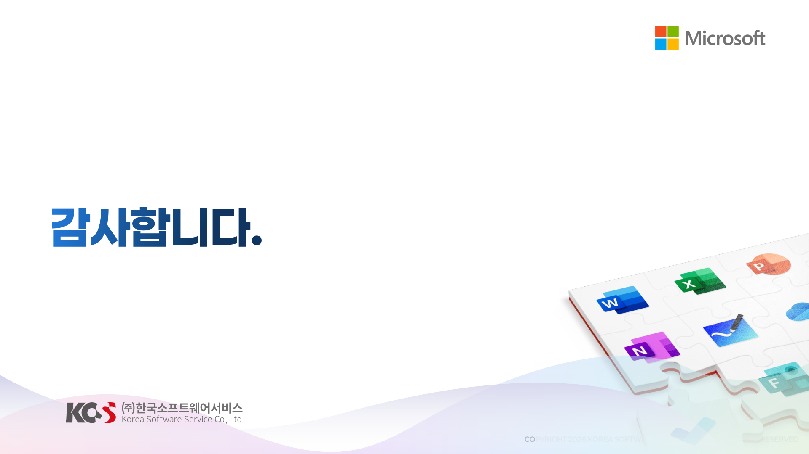

## 01 문서 작성 심화

### 데이터 준비 원칙

### M1-1. Excel 데이터 분석 및 업무 관리 자동화

### M1-2. Word 기반 보고서 작성 자동화

### M1-3. PowerPoint 프레젠테이션 제작 고도화

## 02 협업 문서 작성 심화

### Pages 개념

### M2-2. Copilot Pages를 활용한 협업 및 콘텐츠 관리

## 03 에이전트 활용

### M3-1. Microsoft 에이전트 이해

### M3-2. 업무 시나리오 기반 에이전트 활용

## 04. Agent Builder

## Q&A

