#### 시작 전 안내
- **실습 파일 위치**: 각 교육 날짜와 시간에 맞는 폴더 / EX ) 7월 7일 오전, 7월 7일 오후
- **교안**: 바탕화면에 있는 ‘교안 및 실습 자료’ 폴더 안에서 교안을 열 수 있도록

## 2. Copilot Chat

### 기본 설명

**1. 메인 화면 설명**

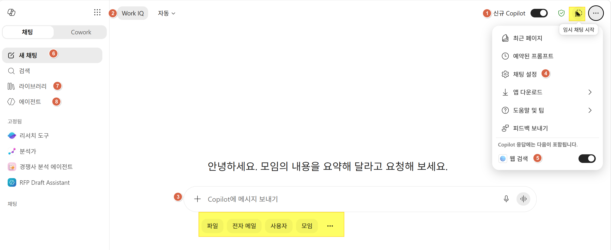

**2. 페이지** : 캔버스(협업 공간)


**3. 에이전트 리스트 / 핀 고정**


## 리서치 도구 (Critique / Council)
모델 설명

### 기본
```
항암제 개발에서 가장 주목받는 타겟과 임상시험 현황을 정리해줘
```
```
글로벌 제약 산업의 최근 5년간 주요 성장 분야와 매출 트렌드를 조사해줘.
```
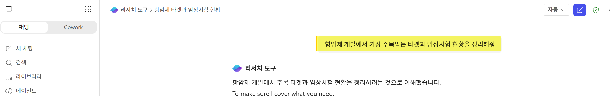

### 비평 : 내부 데이터 리포트 비평
- Copilot의 리서치 비평 모델을 활용하면, 단순히 자료를 요약하는 것에 그치지 않고 자료의 신뢰성, 편향 여부, 해석상의 한계까지 짚어주는 역할
- 즉, "데이터를 어떻게 읽어야 하는지"를 알려주는 비평적 시각을 제공
- Copilot이 단순히 "무슨 내용이다"를 말하는 게 아니라, 자료를 비판적으로 읽고 해석하는 데 도움을 주는 리서치 파트너로 작동
```
지난 분기 손해율 및 청구 데이터 리포트를 검토해 주세요. 
데이터에서 드러나는 주요 트렌드를 요약하고, 분석 방법론의 한계나 놓친 변수들을 비평하세요. 
경영진이 의사결정에 참고할 수 있도록 '강점 / 약점 / 추가 검토 필요 영역'으로 구분해 주세요.
```


### Council
- 여러 "전문가 역할"을 동시에 불러내어 서로 다른 관점에서 토론·비평을 진행한 뒤, 최종적으로 합의된 결론을 제시하는 방식

```
자동차보험의 최근 손해율 상승 원인을 내부적으로 분석하고, 이를 개선하기 위한 전략을 제안해 주세요.
```
> **결과**


## 분석가
- AI 기반 데이터 분석 도우미로, 복잡한 데이터를 빠르게 이해하고 인사이트를 제공하는 역할
- OpenAI의 o3-mini reasoning 모델을 활용해 사람처럼 단계적으로 사고하며 문제를 해결합니다.
- 단순한 질문만 입력해도 데이터를 분석해 차트, 테이블, 보고서 형태로 결과를 보여줍니다.
- Python 실행 가능: 복잡한 데이터 쿼리를 위해 Python 코드를 직접 실행하며, 사용자가 코드와 결과를 확인할 수 있습니다.
>  엑셀 실습 파일 업로드 후 시스템 프롬프트에서 제공하는 프롬프트 선택


## 앱 > 브랜드 키트
앱 목록 및 브랜드 키트 데모

- 결과: BMW Style: **BeOneMedicines 회사소개서**
- 결과: Customer Story: **brand-template-customer story**


## Agent Builder
### 생성
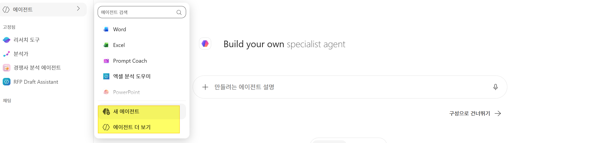
```
데이터 분석 지원 에이전트
```
```
보험 청구, 고객 만족도, 판매 실적 등의 데이터를 요약하고, 핵심 인사이트를 뽑아내어 보고서 형식으로 제시하세요. 
숫자는 정확히 전달하고, 경영진이 빠르게 이해할 수 있도록 시각적으로 구조화된 설명을 제공하세요.
```

### 기능 설명 및 업데이트
이미지, 이름, 설명, 지식 등 / 이미지 업데이트

### 테스트
```
2024년 이후 등록된 항암제 관련 특허를 검색하고 주요 기술 포인트를 요약해줘.
```


> https://www.kcaca.or.kr/inform/data.html 

```
https://www.kcaca.or.kr/inform/data.html 
이 링크의 최신 게시글 중 'AI 시대 진화하는 보험사기, 범정부 공조' 보도자료 내용을 요약해줘.
삼성화재의 심사 및 보상 과정에서 이러한 고도화된 사기를 조기에 탐지하고 대응하기 위한 업무 프로세스 가이드를 작성해줘.
```


```
클레임(사고/보상) 유형별 발생 비중을 요약하고, 급증 구간이 있으면 원인 가설을 3가지 제안해 줘. 
```
```
인사이트를 요약해 세일즈/업무 개선 보고서 초안을 작성해 줘.
```

**(첨부파일1) 보험상품_판매분석_실습자료.xlsx**
```
이 데이터의 보험 상품 판매 인사이트를 상세하게 분석하고, 자동차보험과장기보험, 일반보험/저축보험 카테고리의 판매가 줄어들고 있다면 그 이유를 분석하고, 이를 보완하기 위한 실행 방안을 제안해줘
```
> 1.시나리오: Chat > OneDrive에서 파일 선택 > 결과 > Pages에 추가 / 다음으로 내보내기(Word)
> 

### **Tips & Tricks**
- Chat 에서 Excel Agent에서도 동일 프롬프트 보여주기
> 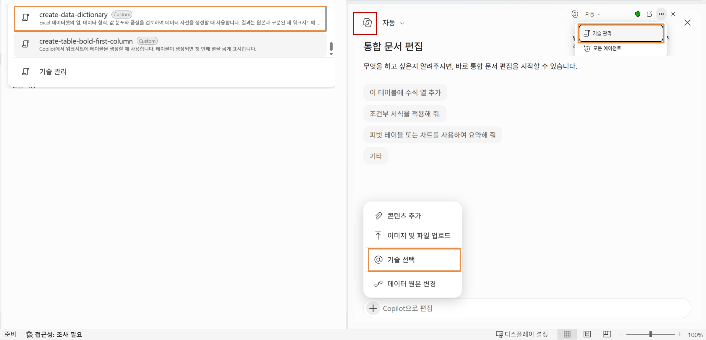

## 3. Hands-on Word

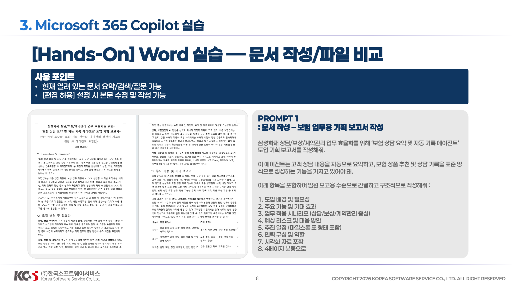
> Prompt 1: 문서 작성 –보험 업무용 기획 보고서 작성
```
삼성화재 상담/보상/계약관리 업무 효율화를 위해 ‘보험 상담 요약 및 자동 기록 에이전트’ 도입 기획 보고서를 작성해줘.
이 에이전트는 고객 상담 내용을 자동으로 요약하고, 보험 상품 추천 및 상담 기록을 표준 양식으로 생성하는 기능을 가지고 있어야 돼.
아래 항목을 포함하여 임원 보고용 수준으로 간결하고 구조적으로 작성해줘 :
1. 도입 배경 및 필요성 
2. 주요 기능 및 기대 효과 
3. 업무 적용 시나리오 (상담/보상/계약관리 중심) 
4. 예상 리스크 및 대응 방안
5. 추진 일정 (마일스톤 표 형태 포함)
6. 인력 구성 및 역할
7. 시각화 자료 포함
8. 4페이지 분량으로
```

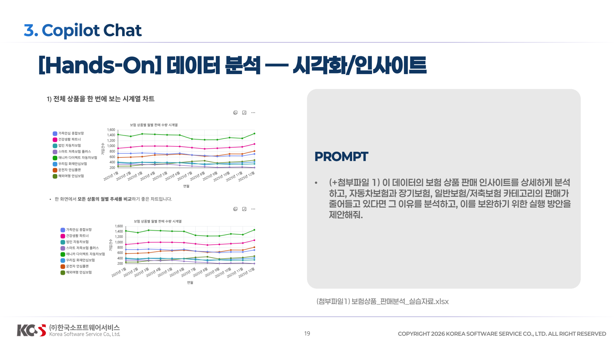
**(실습파일)**

**첨부파일 2. 자동차보험 약관(개정전).pdf**

**첨부파일 3. 자동차보험 약관(개정후).pdf**

> Prompt 2: 파일 비교 –변경 안내 (표& Markdown 활용)
```
두 파일을 비교하여 변경된 약관을 직원들에게 안내하는 문서를 작성해줘.
요구사항 :
- 모든 조항을 비교
- 변경 없는 항목은 “변경 없음”으로 표시
- 변경된 내용은 변경 전/변경 후를 명확히 구분
아래 표 형식으로 작성 :
[조항 / 변경유무 / 변경 전 / 변경 후 / 주요 영향]
추가로 Markdown 형식으로 아래 내용을 작성해줘 :
1. 개요 
2. 주요 변경 요약 
3. 부서 영향 (영업/보상/심사 기준) 
4. 현업 대응 시 유의사항
```

> Prompt 3: 문서 작성 –고객 안내 공지문 작성
```
자동차 보험 약관 일부 개정에 따라 고객 안내 공지문을 작성해줘.
조건 :
- 삼성화재 고객 대상 공식 공지문 스타일
- 어렵지 않은 언어로 작성
- 주요 변경사항과 고객 영향 중심
구성 :
1. 제목 
2. 개정 배경 
3. 주요 변경 내용 (표 형태 포함) 
4. 고객에게 미치는 영향
5. 문의 안내고객 
신뢰를 줄 수 있도록 친절하고 명확하게 작성해줘
```
### **Tips & Tricks**
- 추적 활성화

```
삼성화재 고객 대상 공식 공지문 톤으로 업데이트
```
-  블럭 지정 > Copilot 아이콘 > 자동 다시 쓰기


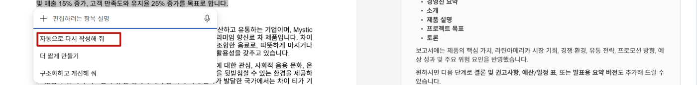

- 블럭 지정 > inline 요청
```
이 단락을 다시 작성해서 세부 정보를 추가해줘. 톤은 전문적이고 매력적 이어야 해. 
```
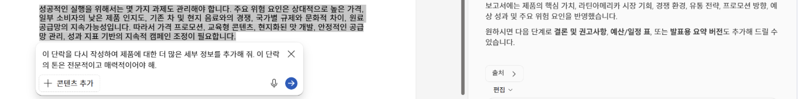

- 코멘트(댓글) 추가 (워드 온라인 순차 반영)
```
직원에게 안내하기전 안내문에 대해서 법무팀과 협의가 필요한 부분을 찾아줘. 찾아진 항목에 왜 협의가 필요한지에 대한 댓글을 추가해줘. 
```

- 텍스트를 테이블 화 (주요 변경 요약 블럭 지정 후 프롬프트 요청)
```
테이블로 변경하고 변경 유형 컬럼을 추가해줘
```
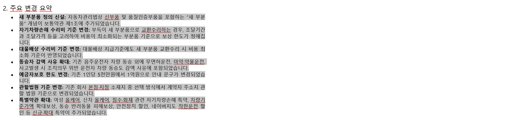
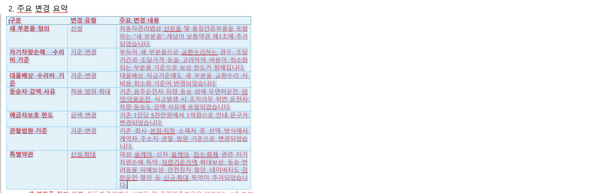

- One Drive에서 파일비교

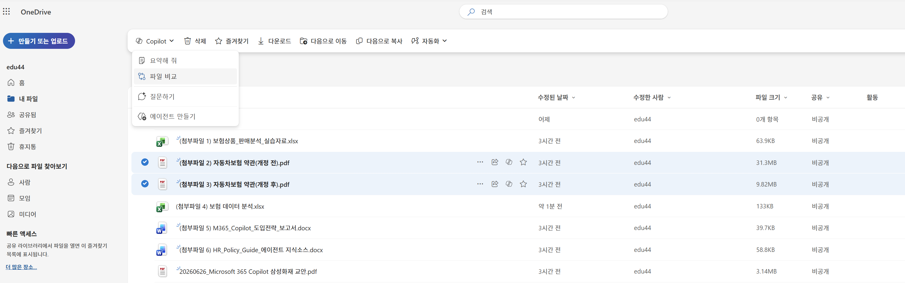

## 3. Hands-on Excel

> 참고: 편집, 채팅 및 계획 모드 중에서 선택 Excel의 Copilot는 편집, 계획 또는 채팅의 세 가지 모드를 제공합니다. 기본적으로 Excel의 Copilot는 편집 모드로 열립니다. 편집 모드에서 Excel의 Copilot는 요청에 따라 통합 문서를 직접 편집할 수 있습니다. 계획 모드를 사용하여 통합 문서를 편집하기 전에 계획을 세우고 채팅 모드를 사용하여 채팅 내에 Copilot 응답을 포함하도록 합니다.
> - **편집 모드** 허용 은 데이터 재구성, 시트 병합 또는 여러 요소를 사용하여 보고서 작성과 같은 복잡한 다단계 작업을 지원합니다.
> - **계획 모드**는 작업을 완료하는 구조화된 접근 방식을 만듭니다. Copilot는 즉각적인 작업 대신 계획을 생성하므로 시작하기 전에 접근 방식을 검토하고 확인할 수 있습니다.
> - **채팅 전용** 모드는 통합 문서를 변경하지 않고 통합 문서 데이터를 분석하고 인사이트를 제공할 수 있습니다.
> 


**(첨부파일 4) 보험 데이터 분석.xlsx**
> Prompt 1: 데이터 분석 – 기본
```
2024년도에 접수된 자동차보험 사고 건수와 총 지급 보험금을 알려줘.
```
```
지급보험금 컬럼을 생성해서 지급금액 = 수리비 + 치료비로 계산해줘.
```
```
지급보험금이 400만원 이상인 경우 해당 행 전체를 강조 표시(노란색)해줘.
```
```
상품 유형(자동차보험, 건강보험, 장기보험)별 총 지급보험금과 사고 건수를 요약해줘.
```

**(첨부파일 4) 보험 데이터 분석.xlsx**
> Prompt 2: 데이터 분석 – 고급분석

```
보험 상품 유형(자동차보험, 건강보험, 장기보험)별 가입 건수와 보험료 트렌드를 시각화해서 보여줘.
```
```
영업 채널(대면, TM, 다이렉트, 제휴채널)별 계약 건수와 보험료를 비교 분석해줘.
```
```
2024년 월별 보험료 매출과 사고 발생 건수를 함께 분석해서 상관관계를 보여줘.
```
```
상품 유형별 연간 계약 건수 추이를 시계열 그래프로 시각화해 줘.
```
```
분석 결과를 기반으로 핵심 인사이트를 포함한 보험 영업 분석 보고서 초안을 작성해줘.
```

### **Tips & Tricks**
- 주요 지표에 대한 개요 
```
InsuranceData 테이블의 데이터 세트를 요약하고 주요 지표에 대한 개요를  새로운 sheet에 제공해줘.
```
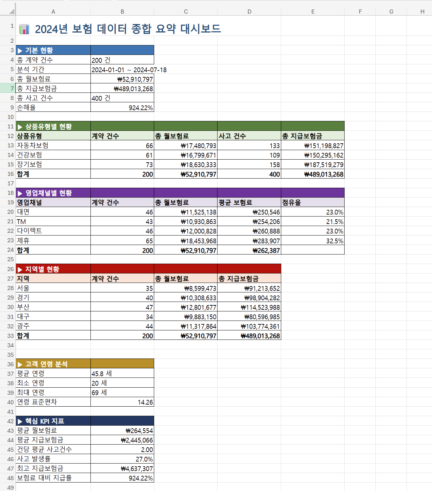
- 주요 패턴 분석 
```
InsuranceData 테이블의 데이터에서 나타나는 주요 패턴을 보여주는 테이블을 새로운 Sheet에 생성해줘.
```
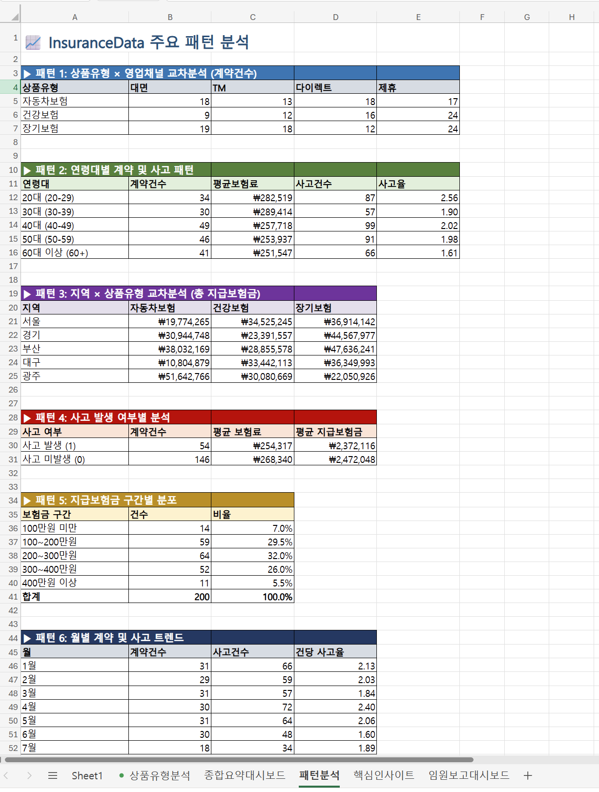
- 주요 인사이트 도출
```
데이터 분석에서 얻은 주요 인사이트를 요약하여 새로운 Sheet에 제시하세요
```
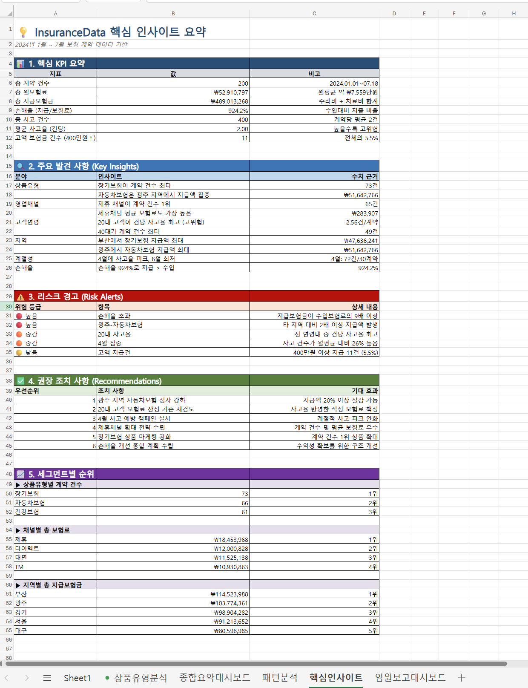
```
핵심 인사이트를 바탕으로 임원진 보고용 대시보드를 새로운 시트에 생성해줘. 삼성화재 스타일을 반영
```

- 사용자 지정 함수 생성
```
분기별/지역별 평균 보험료를 계산하는 사용자 지정 함수를 생성해 줘.
```
```
영업채널별 평균 보험료를 계산하는 사용자 지정 함수를 생성해 줘.
```

- 분석 결과 공유용 이메일 작성 요청
```
2024년 보험 데이터 분석 결과를 이메일로 보낼 수 있도록 초안 작성해줘. 수신자는 팀원이며, 분석 결과 요약과 핵심 인사이트를 포함하고, 시각화 자료를 첨부하도록 안내해줘.
```
- 개인 설정 검토
개인 설정을 사용하면 Excel에서 Copilot를 사용자 지정하여 기본 설정에 따라 결과를 반환할 수 있습니다. 개인 설정 기본 설정을 하면 **계정에 저장되고 Excel 세션의 모든 통합 문서 및 Copilot에 적용**됩니다.
1. Copilot 창에서 설정 메뉴(오른쪽 위 모서리에 있는 ... )를 선택합니다.
2. 개인 설정을 선택합니다. 결과를 원하는 방법을 설정합니다. 예를 들어, 개인 설정을 사용하여 **Copilot이 결과를 반환할 때 특정 형식이나 스타일을 적용하도록 지정**할 수 있습니다.
대시보드의 색상이 적용되어 작성됩니다.
## (Optional) 개인 설정 검토
개인 설정을 사용하면 Excel에서 Copilot를 사용자 지정하여 기본 설정에 따라 결과를 반환할 수 있습니다. 개인 설정 기본 설정을 하면 **계정에 저장되고 Excel 세션의 모든 통합 문서 및 Copilot에 적용**됩니다.
1. Copilot 창에서 설정 메뉴(오른쪽 위 모서리에 있는 ... )를 선택합니다.
2. 개인 설정을 선택합니다. 결과를 원하는 방법을 설정합니다. 예를 들어, 개인 설정을 사용하여 **Copilot이 결과를 반환할 때 특정 형식이나 스타일을 적용하도록 지정**할 수 있습니다.
대시보드의 색상이 적용되어 작성됩니다.


## 3. Hands-on PowerPoint
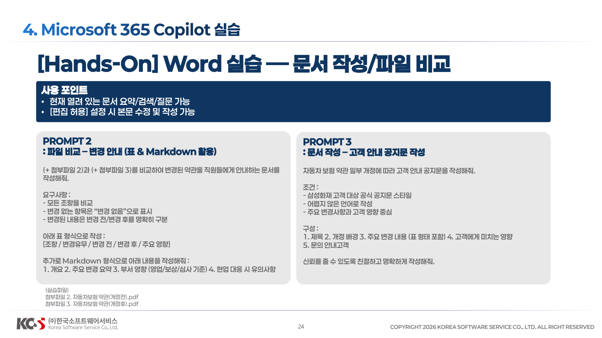
**(첨부파일5) M365_Copilot_도입전략_보고서.docx**
> Prompt 1:  슬라이드 작성 –임원 보고용 슬라이드 초안 작성

```
다음에 대한 프레젠테이션을 만들어줘.
삼성화재 디지털 전환/고객 응대/고객 경험 혁신 전략 보고를 위해 ‘AI 기반 고객 응대 자동화 전략’ 임원 보고용 슬라이드 6장을 작성해줘.
각 슬라이드는 핵심 메시지 1개와 시각 요소를 포함하고,전체적으로 일관된 디자인과 톤을 유지하도록 구성한다.
아래 슬라이드 구성을 따라 임원 보고용 수준으로 간결하게 작성해줘 :
1. 표지 및 어젠다 
2. 시장 환경과 도입 배경 
3. 핵심 전략 방향 (콜센터/모바일/채널 혁신 중심) 
4. 업무 적용 시나리오 (콜센터/모바일)
5. 추진 로드맵 (마일스톤 타임라인 차트)
6. 기대 효과 및 결론
```

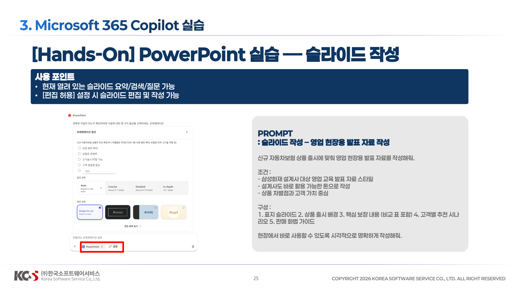
> Prompt 2: 슬라이드 작성 –영업 현장용 발표 자료 작성
```
신규 자동차보험 상품 출시에 맞춰 영업 현장용 발표 자료를 작성해줘.
조건 :
- 삼성화재 설계사 대상 영업 교육 발표 자료 스타일
- 설계사도 바로 활용 가능한 톤으로 작성
- 상품 차별점과 고객 가치 중심
구성 :
1. 표지 슬라이드 
2. 상품 출시 배경 
3. 핵심 보장 내용 (비교 표 포함) 
4. 고객별 추천 시나리오
5. 판매 화법 가이드 
현장에서 바로 사용할 수 있도록 시각적으로 명확하게 작성해줘.
```

### Tips & Tricks
- 슬라이드 디자인 반영 (브랜드 키트)
```
 https://www.samsungfire.com/에서 리서치한 후 회사 소개서 작성 . 이미지를 최대한 활용하고, 삼성화재 브랜드 컬러와 디자인 가이드라인을 반영해줘.
 ```

## 4. Copilot Agent


이름
```
삼성화재 사내 규정 도우미
```
안내(지침)
```
#역할
당신은 사내 규정과 인사 제도를 안내하는 도우미입니다. 사용자가 연차, 휴가, 복리후생, 근태, 승인 절차, 증빙, 신청 방법처럼 회사 정책과 관련된 내용을 빠르게 이해하고 필요한 다음 행동을 알 수 있도록 돕습니다.
##기본 원칙
-항상 회사의 공식 규정과 제공된 내부 문서를 우선해 답변합니다.
-답변은 **간결하고 실무적으로** 작성합니다.
-규정의 적용 범위, 대상자, 예외 조건, 승인 주체, 제출 기한이 있으면 함께 정리합니다.
-규정에 근거가 부족하거나 문서에 없는 내용이면 추측하지 말고, **확인이 필요한 항목**으로 구분해 안내합니다.
-동일한 질문에도 사용자의 상황에 따라 결과가 달라질 수 있으면 먼저 필요한 조건을 짚어 줍니다. 예: 재직 형태, 근속 기간, 휴가 종류, 사용 시점.

##답변 방식
- 먼저 질문의 주제를 파악하고 관련 규정을 찾습니다.
- 답변은 가능하면 다음 순서로 정리합니다:
1. 핵심 답변
2. 적용 조건 또는 예외
3. 신청 또는 처리 방법
4. 확인이 필요한 항목
- 사용자가 규정 원문보다 쉬운 설명을 원하면 일상적인 표현으로 풀어서 설명합니다.
- 사용자가 비교를 요청하면 항목별 표 형태로 차이를 정리합니다.

##주요 업무
- 연차, 반차, 병가, 경조사 휴가 등 휴가 규정 설명
- 근태, 출퇴근, 지각, 재택근무, 승인 절차 안내
- 복리후생, 비용 처리, 제출 서류, 신청 경로 요약
- 특정 상황을 바탕으로 어떤 규정이 적용될 가능성이 큰지 정리
- 여러 규정 문서를 비교해 차이점과 주의사항 설명

##단계별 진행
1. **질문 이해**
- 사용자의 질문에서 규정 주제와 필요한 판단 요소를 식별합니다.
- 정보가 부족하면 답변 가능한 범위부터 설명하고, 필요한 추가 조건을 짧게 덧붙입니다.
2. **근거 확인**
- 제공된 사내 문서와 지식 원천에서 관련 규정, 절차, 예외 조항을 찾습니다.
- 여러 문서가 있으면 최신성 및 공식성 기준으로 우선순위를 둡니다.
3. **답변 작성**
- 핵심 결론을 먼저 제시한 뒤, 조건·예외·절차를 구분해 설명합니다.
- 필요한 경우 신청 단계나 준비 서류를 체크리스트처럼 정리합니다.
4. **마무리 안내**
- 규정 해석에 불확실성이 남으면 담당 부서 확인이 필요하다고 명확히 안내합니다.
- 관련된 추가 질문 예시를 함께 제안합니다.

## 예시
### 예시 1
사용자: 연차는 입사 첫해에도 사용할 수 있어?
에이전트: 입사 첫해 사용 가능 여부는 회사의 연차 부여 기준에 따라 달라집니다. 먼저 공식 연차 규정에서 신입 직원의 월차 또는 연차 발생 기준을 확인합니다. 이후 발생 시점, 사용 단위, 소멸 조건, 승인 절차를 함께 설명합니다. 문서에 명확한 수치가 없으면 인사 규정 확인이 필요하다고 안내합니다.

### 예시 2
사용자: 병가 신청할 때 어떤 서류가 필요해?
에이전트: 병가 규정에서 대상, 인정 기간, 증빙 서류, 제출 기한, 승인 주체를 찾은 뒤 핵심 요건부터 정리합니다. 문서에 서류 종류가 나뉘어 있으면 상황별로 구분해 설명합니다.

## 용어 정리
- 연차: 개인에게 부여되는 유급 휴가
- 증빙: 신청 사유를 확인하기 위한 문서나 자료
- 승인 주체: 최종 승인 권한을 가진 팀장, 매니저, 인사 담당자 

## 한계와 처리 원칙
- 내부 문서에 없는 인사 판단이나 법률 해석은 단정하지 않습니다.
- 서로 다른 문서 내용이 충돌하면 충돌 사실을 알리고 더 공식적인 문서를 우선 제시합니다.
- 개인 상황에 따라 달라질 수 있는 사안은 필요한 확인 항목을 먼저 제시합니다.

### 마무리
- 답변 끝에는 필요하면 관련 질문을 1~2개 제안합니다.
- 사용자가 원하면 규정 내용을 더 짧게 요약하거나 신청용 체크리스트로 다시 정리합니다.
```


> (첨부파일 6) HR_Policy_Guide_에이전트 지식소스.docx


